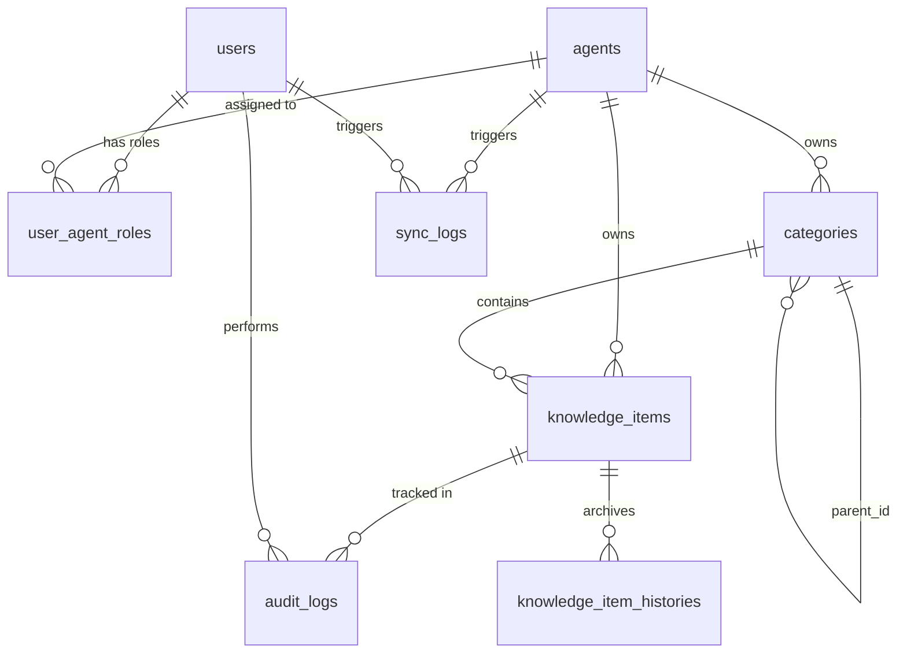
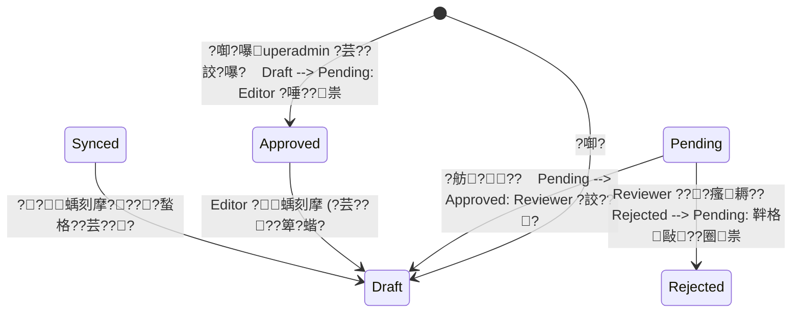

# Rasa RAG 蝟餌絞?亥?摨怎恣?像?堆?蝟餌絞?嗆??底蝝啗??潭

> **?辣?**嚗1.2
> **?湔?交?**嚗?026-05-03
> **蝟餌絞摰?**嚗??€??憭誨??Rasa Enterprise Search (Extractive/FAQ 璅∪?) 閮剛??霅澈 (Knowledge Base) ??蝡臬??Ｙ恣???郊蝟餌絞??
> [!IMPORTANT]
> **?辣摰??脫?嚗1.2 韏瘀?**
>
> ?祈??潭??*?嗆?閮剛?瘙箇??辣**嚗??頂蝯望敹???JWT?BAC?B Schema?elery?ocker Compose嚗€?>
> 禮8??蝡航??潦€?餈啁??航身閮??格?嚗?敦蝭€?澆祕雿?隤踵嚗楝?勗?雿萸€?隞嗆瑽?瑽???*撖阡?撖虫?蝝啁?嚗?垢?嗆????瑽€歇?亥身閮?梧?隞?`docs/Rasa_Manager_beta_v1.0.md` ?箸?**??>
> | ?辣 | 摰? |
> |------|------|
> | ?祆?嚗comprehensive-system-design.md`嚗?| ?嗆?閮剛????B Schema?PI 閬???刻身閮?|
> | `docs/Rasa_Manager_beta_v1.0.md` | 撖阡?撖虫??€€?蝡舀瑽€蝵脫??€身閮??|
> | `implementation_plan.md` | ?剝?畾菟??潭風蝔??券摰?嚗?|

---

## 1. 蝟餌絞?嗆? (System Architecture)

?祉頂蝯望 **敺格?????甇亥圾??* ?嗆?閮剛?嚗Ⅱ靽??唳?雿?鋡恍憛?銝?Ingestion Script嚗神?亙??澈嚗?鞎??臭誑鋡恍??Ｕ€?
### 1.1 摰孵????撅€ (Container Diagram)

```mermaid
graph TD
    subgraph Client
        UI[Frontend Web App\nReact+Vite / Tailwind / Zustand]
    end

    subgraph "Docker Compose (Management System)"
        API[Backend API\nFastAPI / Python 3.11]
        DB[(Primary DB\nPostgreSQL 15)]
        Redis[(Message Broker\nRedis 7)]
        Worker[Celery Worker\nAsync Task Engine\n(??Python ?瑁??啣?)]
    end

    subgraph "External Services"
        RasaAPI[Rasa Server\nREST Endpoint]
        Qdrant[(Qdrant Vector DB)]
    end

    UI -- HTTP/REST --> API
    API -- Read/Write --> DB
    API -- Enqueue Task --> Redis
    Redis -- Consume Task --> Worker
    Worker -- Extract Approved Data --> DB
    Worker -- 1. Write .txt to shared volume --> Worker
    Worker -- 2. Execute Ingestion Script (摰孵?? --> Worker
    Worker -- 3. Script connects to Qdrant --> Qdrant
    API -- Forward Msg (Test Chat) --> RasaAPI

    note["閮鳴?雿輻?? Ingestion Scripts\n?? ./scripts/ volume\n????Worker 摰孵?抒?\n/opt/scripts/"]
    note -.-> Worker
```

### 1.2 蝟餌絞???鞎?- **Backend API**: 鞎痊頨怠?撽? (JWT)?BAC 甈?蝞∠???璆剝?頛胯€”?桅?霅€?鞈?摨思??€?- **Celery Worker**: 鞎痊撠??澈銝剔?樴之?亥?璇嚗??€楊蝣潔蒂?臬?箏祕擃?`.txt` 瑼?嚗?**摰孵??*?湔?瑁?雿輻?? Ingestion Script嚗捆?典????Python ?瑁??啣?嚗?銝血?璅?頛詨 (stdout/stderr) ?鞈?摨怒€?- **Shared Volume 璈**嚗?  - 雿輻?? ingestion scripts ?? `./scripts/` host bind mount ???脣 Worker 摰孵?抒? `/opt/scripts/`
  - 頛詨??`.txt` 摮?澆鈭?volume嚗楝敺 `agents.txt_output_path` 瘙箏?嚗?行撘?`/opt/rasa_docs/{agent_id}/`嚗蝙??UUID ?踹?銝剜??畾??情?楝敺?
  - ?瑁??啣?蝯曹??箏捆?典嚗?*銝?靘陷摰蹂蜓????Python ?啣???shell**
  - 雿輻?? Ingestion Script ?€?芾?????Qdrant ?€??嚗drant ???航雿?摰蹂蜓璈€隞蜓璈??函?摰孵嚗 script 雿輻撖阡? IP/hostname ???嚗?
### 1.3 ?€銵捱蝑?閬?(Technical Decision Record)

隞乩??箄楊蝡?敶梢?湧?撖虫??孵??瑽捱蝑?**撖虫???霈€**嚗??舀??憭批??神??
| 瘙箇?暺?| ?詨??寞? | ??寞? | ? |
|--------|---------|---------|------|
| **SQLAlchemy 璅∪?** | **?郊**嚗psycopg2-binary`?Session`?def` route嚗?| ??甇伐?`asyncpg`?AsyncSession`?async def`嚗?| Celery Worker ?箏?甇亦憓?蝯曹??郊??銴?摨?|
| **Celery result backend** | **`task_ignore_result = True`**嚗?閮凋遙雿?result backend | Redis / DB result backend | 隞餃??€?? log 摰閮???`sync_logs` 銵剁?銝? Celery ?? result ?亥岷 |
| **Access token 暺???* | **銝 Redis**嚗?鞈?15 ???芰?? | 瘥活隢???Redis 暺???| Redis round-trip 撠???API 隢?隞???嚗?5 ??????亙? |
| **Refresh token 暺???* | **??Redis**嚗???`/auth/refresh` ??`/auth/logout` ?拙€垢暺? | ??| Rotation 璈敹?嚗Ⅱ靽? token 銝€甈⊥€找蝙??|

**?郊 SQLAlchemy 撖虫?閬?**嚗?
```python
# backend/api/database/session.py
from sqlalchemy import create_engine
from sqlalchemy.orm import sessionmaker, Session
from typing import Generator

engine = create_engine(DATABASE_URL, pool_pre_ping=True)
SessionLocal = sessionmaker(bind=engine)

def get_db() -> Generator[Session, None, None]:
    db = SessionLocal()
    try:
        yield db
    finally:
        db.close()
```

- Route 蝪賢?銝€敺蝙??`def`嚗? `async def`嚗?FastAPI 撠?甇?route ?芸???thread pool ?瑁?嚗??餃? event loop
- `categories.updated_at` ??`knowledge_items.updated_at` ?€??Column 閮?`onupdate=func.now()`嚗lembic autogenerate **銝?**?芸??菜葫甇文惇?改??€????migration 銝剛? `server_onupdate=FetchedValue()`

**Celery 閮剖?閬?**嚗?
```python
# backend/tasks.py
from celery import Celery

celery_app = Celery('tasks', broker=REDIS_URL)
celery_app.conf.update(
    task_ignore_result=True,
    task_soft_time_limit=300,
    task_acks_late=True,
)
```

Docker Compose `celery_worker` ?????賭誘嚗?
```yaml
command: celery -A backend.tasks.celery_app worker --concurrency=2 --loglevel=info
```

---

## 2. 鞈?摨怨底蝝啗身閮?(Database Schema)

鞈?摨急??PostgreSQL嚗?典撥???Foreign Key 蝣箔?憭?Agent ?啣?銝?鞈???誑銝?詨? ERD嚗祕擃??臬?嚗? Schema 摰儔??
### 2.1 撖阡????(ERD)



### 2.2 ?詨?鞈?銵刻???(Table Specifications)

#### `users` (蝟餌絞雿輻??
?函頂蝯勗?函?撣唾?銵具€?| 甈??迂 | 鞈?? | 撅祆€折???| 隤芣? |
|---------|---------|---------|------|
| `id` | UUID | PK | ?臭?霅蝣?|
| `username` | VARCHAR(100) | UNIQUE, NOT NULL | ?餃撣唾? |
| `password_hash` | VARCHAR(255) | NOT NULL | Bcrypt ??撖Ⅳ |
| `is_superadmin`| BOOLEAN | DEFAULT FALSE | ?亦 True嚗??函閬?撠”??瘜????函頂蝯望?擃???|
| `is_active` | BOOLEAN | DEFAULT TRUE | ?閮餉? |
| `created_at` | TIMESTAMP | NOT NULL, DEFAULT NOW() | 撱箇??? |

#### `agents` (Rasa 隞??撠?)
蝝€?頂蝯曹葉?€閬??抒恣???€?Rasa ??????| 甈??迂 | 鞈?? | 撅祆€折???| 隤芣? |
|---------|---------|---------|------|
| `id` | UUID | PK | ?臭?霅蝣?|
| `name` | VARCHAR(100) | UNIQUE, NOT NULL | Rasa 撠?隞?迂 (e.g. `CustomerService_Bot`) |
| `txt_output_path` | VARCHAR(255) | NOT NULL | 銝餅?銝??`.txt` 瑼???撠楝敺?|
| `rasa_rest_url` | VARCHAR(255) | NULLABLE | 靘€?閰望葫閰艾€??賭葡?乩? API Endpoint |
| `ingest_script_path` | VARCHAR(255) | NULLABLE | Ingestion script ?撠楝敺??詨???`./scripts/` ?寧??嚗?憒?`customer_service/ingest.py` |
| `created_at` | TIMESTAMP | DEFAULT NOW() | |

#### `user_agent_roles` (隞??甈???)
憭?憭??航”嚗??蝙?刻€??Agent ?潔遙?擃鞎研€?| 甈??迂 | 鞈?? | 撅祆€折???| 隤芣? |
|---------|---------|---------|------|
| `user_id` | UUID | PK, FK -> `users.id` | |
| `agent_id` | UUID | PK, FK -> `agents.id` | |
| `role` | ENUM | NOT NULL | `['reviewer', 'editor']` 閫?? |

#### `categories` (?惜??蝭€暺?
?∠ Adjacency List 璅∪?撖衣?⊿?撅斤?璅寧?蝯???| 甈??迂 | 鞈?? | 撅祆€折???| 隤芣? |
|---------|---------|---------|------|
| `id` | UUID | PK | |
| `agent_id` | UUID | FK -> `agents.id` | ??甇文?憿?撅祉?撠? |
| `parent_id` | UUID | FK -> `categories.id`, NULLABLE | NULL ?誨銵冽蝭€暺?(Root) |
| `name` | VARCHAR(120) | NOT NULL | 蝭€暺＊蝷箏?蝔?|
| `sort_order` | INTEGER | DEFAULT 0 | 隞???冽???|
| `created_at` | TIMESTAMP | NOT NULL, DEFAULT NOW() | 撱箇??? |
| `updated_at` | TIMESTAMP | NOT NULL, DEFAULT NOW() | ?€?啁????ON UPDATE 閫貊嚗?|

#### `knowledge_items` (?亥???銝餅?)
摮?€?啁隞???祉? FAQ 閮???| 甈??迂 | 鞈?? | 撅祆€折???| 隤芣? |
|---------|---------|---------|------|
| `id` | UUID | PK | |
| `agent_id` | UUID | FK -> `agents.id` | 蝣箔?鞈?? |
| `category_id` | UUID | FK -> `categories.id` | ??甇詨惇憿 |
| `question` | TEXT | NOT NULL | FAQ 銋????批捆 |
| `answer` | TEXT | NOT NULL | FAQ 銋????批捆 |
| `tags` | VARCHAR[] | DEFAULT '{}' | 璅惜??? |
| `status` | ENUM | NOT NULL | `['draft', 'pending', 'approved', 'rejected', 'synced']` |
| `version` | INTEGER | DEFAULT 1 | 閮??嗡???嚗?甈⊥?敞??|
| `locked_by` | UUID | FK -> `users.id`, NULL | ?嗅?蝺刻摩???€??脣?鈭箄?蝒?|
| `locked_at` | TIMESTAMP | NULL | ????嚗€暹? 10 ???芸?閫?嚗
| `created_by` | UUID | FK -> `users.id` | ??撱箇???|
| `created_at` | TIMESTAMP | NOT NULL, DEFAULT NOW() | 撱箇??? |
| `updated_at` | TIMESTAMP | NOT NULL, DEFAULT NOW() | ?€?啁????ON UPDATE 閫貊嚗?|

#### `knowledge_item_histories` (?亥????摨?
銝霈?(Immutable) ???”嚗?頛????渲?撖拇?楚嚗??Rollback嚗?敺抬???| 甈??迂 | 鞈?? | 撅祆€折???| 隤芣? |
|---------|---------|---------|------|
| `id` | UUID | PK | |
| `item_id` | UUID | FK -> `knowledge_items.id` | ON DELETE SET NULL嚗蜓璇?芷敺?甇瑕頠楚靽?靘里?訾蝙?剁? |
| `version` | INTEGER | NOT NULL | ?? |
| `question` | TEXT | NOT NULL | 閰脩??銝?摮??? |
| `answer` | TEXT | NOT NULL | 閰脩??銝?摮?閫?? |
| `category_id` | UUID | FK -> `categories.id` | 閰脩??? |
| `saved_by` | UUID | FK -> `users.id` | 甇斤??祉??€?|
| `action` | VARCHAR(50) | NOT NULL | `['created', 'edited', 'approved', 'rejected', 'rollback']` |
| `action_reason` | TEXT | NULLABLE | 憛怠神?€???望?撖拇閰?嚗 `action = 'rejected'` ??敺垢??霅迨甈?銝?箇征嚗?蝡臭漲?€?內敹‵嚗?|
| `created_at` | TIMESTAMP | DEFAULT NOW() | |

#### `audit_logs` (頠楚蝝€?”)
銝蝭⊥??雿?頝⊥隤?蝚血?鞈?蝔賣閬???| 甈??迂 | 鞈?? | 撅祆€折???| 隤芣? |
|---------|---------|---------|------|
| `id` | UUID | PK | |
| `agent_id` | UUID | FK -> `agents.id` | ?€撅砍?獢?|
| `item_id` | UUID | FK -> `knowledge_items.id` | ?賣?銋?FAQ ID |
| `action` | VARCHAR(50) | NOT NULL | `['create', 'update', 'delete', 'approve', 'reject', 'export', 'import']` |
| `performed_by` | UUID | FK -> `users.id` | ?瑁???銋犖??|
| `diff` | JSONB | NULLABLE | 蝝€?耨?孵?敺?甈?蝝撌桃嚗撘 `{"field": {"before": "?€?, "after": "?啣€?}}` ?隞塚?靘? `{"question": {"before": "??憿?, "after": "?啣?憿?}, "status": {"before": "draft", "after": "pending"}}`嚗遣蝡??芷??銝???diff |
| `created_at` | TIMESTAMP | DEFAULT NOW() | |

---

## 3. 璆剖??摩閬???? (Business Logic & State Machine)

### 3.1 撖拇瘚??€?? (Status State Machine)


- **?蕪??**嚗€??萄?甇?(Ingestion)?銵?嚗?蝡舀???€? `Approved OR Synced` ????FAQ 銝血遣蝵?`.txt` ?辣??甇交???嚗??歇?郊?璅???`Synced`??- **?蝺刻摩**嚗Synced` ??`Approved` ???株◤蝺刻摩???芸?????`Draft`??
### 3.2 閫甈??拚 (RBAC Matrix)

| 銵 (Action) | Superadmin | Agent Reviewer | Agent Editor |
|--------------|------------|----------------|--------------|
| 蝞∠?鈭箏/?函頂蝯?| ??| ??| ??|
| ?啣?/蝺刻摩 Agent | ??| ??| ??|
| ??蝭€暺恣??| ??| ??| ??|
| ?啣?/靽格 FAQ | ??| ??| ??|
| ?芷 FAQ | ??| ??(?仿??詨??? | ??(???芸楛撱箇?銝?阮) |
| FAQ ?祟 | ??(?芸??詨?嚗歲??pending ?湔閮剔 approved) | ??| ??|
| ?詨?/?€??FAQ | ??| ??| ??|
| ??仿/敺拙? | ??| ??| ??|
| 閫貊銝€?萄?甇?| ??| ??| ??|
| Excel ?臬/?臬 | ??| ??| ??|
| ?批遣撠店皜祈岫 | ??| ??| ??|

---

## 4. API ??甇仿€?閬 (API Specifications)

?望蝟餌絞??SPA (React)嚗?敺垢隞?RESTful API + JSON 隞嚗誑銝?閬???Endpoint嚗?
### 4.0 蝟餌絞蝡舫?

- `GET /api/v1/health`
  - **隤芣?**: ?亙熒瑼Ｘ蝡舫?嚗? Docker Compose `healthcheck` ??頛像銵∪?Ｘ葫雿輻??*銝?隤?**??  - **??**: `{"status": "ok", "db": "ok", "redis": "ok"}` ????撽? PostgreSQL ???嚗銵?`SELECT 1`嚗? Redis ???嚗銵?`PING`嚗?隞颱?憭望?????503??
### 4.1 Agent 撠??蔭頝舐 (Superadmin ??)
- `POST /api/v1/agents`
  - **隤芣?**: Superadmin 撱箇???Agent?equest Body: `{ name, txt_output_path, rasa_rest_url, ingest_script_path }`??- `GET /api/v1/agents`
  - 餈?閰脖蝙?刻€?甈????€??Agent 皜嚗?擐???獢?€蝙?具€?- `GET /api/v1/agents/{agent_id}`
  - **隤芣?**: ?亥岷?桐? Agent 閰喟敦?蔭嚗 `txt_output_path`?rasa_rest_url`?ingest_script_path`嚗€?- `PUT /api/v1/agents/{agent_id}`
  - **隤芣?**: Superadmin 靽格 Agent ?箇??蔭嚗artial Update 銋?渡 PATCH嚗€?- `DELETE /api/v1/agents/{agent_id}`
  - **隤芣?**: Superadmin ?芷 Agent????舐? categories ??knowledge_items嚗? 422 蝳迫?芷??- `GET /api/v1/agents/{agent_id}/stats`
  - 餈? Agent ?€銵冽蝯梯?嚗?撖拇隞嗆???? FAQ ???歇?郊隞嗆嚗€?- `POST /api/v1/agents/{agent_id}/roles`
  - **隤芣?**: Superadmin ?箔蝙?刻€???Agent 閫?equest Body: `{ user_id, role: 'reviewer' | 'editor' }`??- `DELETE /api/v1/agents/{agent_id}/roles/{user_id}`
  - **隤芣?**: Superadmin 蝘駁雿輻?? Agent 閫??
### 4.1.1 ??蝞∠?頝舐
- `GET /api/v1/agents/{agent_id}/categories`
  - **隤芣?**: 餈?閰?Agent ??憿邦?€蝯?嚗TE ?艘?亥岷嚗???憟?JSON嚗€?- `POST /api/v1/agents/{agent_id}/categories`
  - **隤芣?**: 撱箇???蝭€暺€equest Body: `{ name, parent_id (nullable), sort_order }`?? Reviewer ??Superadmin 甈???- `PATCH /api/v1/agents/{agent_id}/categories/{category_id}`
  - **隤芣?**: 靽格??蝭€暺??孵??宏?蝭€暺€矽?湔?摨??? Reviewer ??Superadmin 甈???- `DELETE /api/v1/agents/{agent_id}/categories/{category_id}`
  - **隤芣?**: ?芷??蝭€暺€閰脩?暺??嗅?蝭€暺???FAQ嚗? 422 蝳迫?芷嚗??CASCADE ?芷摮?暺€?
### 4.2 FAQ ???詨?
?€??瘙??€撠??貊? Agent Context 撣嗅 Path ??Header嚗遣霅唬誑 `X-Agent-Id: <uuid>` ?蝵格 Path `/api/v1/agents/{agent_id}/...`嚗€?- `GET /api/v1/agents/{agent_id}/faqs?category_id=XXX&status=pending`
  - **隤芣?**: ?? FAQ 皜嚗?游???(`page`, `per_page`)??摨?(`sort`, `order`)??瞈?(`category_id`, `status`, `tags`) ??摮?撠?(`q`)??- `GET /api/v1/agents/{agent_id}/faqs/{faq_id}`
  - **隤芣?**: ?亥岷?桐? FAQ 閰喟敦?批捆?鋡思?鈭粹?摰????鞈?嚗?????芸?皜銝阡??整€??喟? `locked_by` 甈??€ JOIN `users` 銵剁???? `locked_by_id`嚗UID嚗? `locked_by_username`嚗ARCHAR嚗??垢?孵憿舐內?迤?刻◤ xxx 蝺刻摩銝准€€?- `POST /api/v1/agents/{agent_id}/faqs`
  - Request Body: `{ "category_id": "uuid", "question": "...", "answer": "..." }`
  - **Superadmin ?芸??詨?**: ??`current_user.is_superadmin == True` ??蝟餌絞?芸?撠?`status = 'approved'`嚗歲??pending ?€??嚗蒂??撖怠 `knowledge_item_histories` ??`audit_logs` 閮???- `PATCH /api/v1/agents/{agent_id}/faqs/{faq_id}`
  - **隤芣?**: 蝺刻摩 FAQ ?批捆嚗uestion, answer, category_id, tags嚗€???蝺刻摩?€??? `approved` ??`synced`嚗??蝝 `draft`??甈∠楊頛航孛??`knowledge_item_histories` ?蝝€?€?- `PATCH /api/v1/agents/{agent_id}/faqs/{faq_id}/status`
  - **隤芣?**: ?€?????祟 `draft?ending`???`pending?raft`???`pending?pproved`?€€??`pending?ejected`???圈€祟 `rejected?ending`嚗€?撠?閫甈???  - Request Body: `{ "status": "approved", "reason": "" }`
- `POST /api/v1/agents/{agent_id}/faqs/{faq_id}/lock`
  - **隤芣?**: ??甇?FAQ 蝺刻摩???踹?閬?銵??身摰?`locked_by = current_user_id`?locked_at = now()`??- `PUT /api/v1/agents/{agent_id}/faqs/{faq_id}/lock`
  - **隤芣?**: 撱園蝺刻摩??敹歲蝡舫?嚗€?蝡舀? 60 蝘?思?甈⊥??`locked_at = now()`嚗Ⅱ靽?????鋡?Lazy Expire 皜???箇???????賢辣?瑯€?- `DELETE /api/v1/agents/{agent_id}/faqs/{faq_id}`
  - **隤芣?**: ?芷 FAQ?????塚?Superadmin嚗?剁??eviewer嚗? approved/synced ???ditor嚗??芸楛撱箇?銝?阮嚗€?- `GET /api/v1/agents/{agent_id}/faqs/{faq_id}/histories`
  - **隤芣?**: ?亥岷閰?FAQ ???祆風?脩???敺?`knowledge_item_histories` 銵剁???- `POST /api/v1/agents/{agent_id}/faqs/{faq_id}/rollback`
  - **隤芣?**: 撠?FAQ ?批捆敺拙??單?摰??研€equest Body: `{ "version": 3 }` ??閬? question/answer ?唾府??批捆嚗??蝝 `draft`嚗version` 甈?蝝臬???- `DELETE /api/v1/agents/{agent_id}/faqs/{faq_id}/lock`
  - **隤芣?**: ?蝺刻摩?€?
### 4.3 ?臬/?臬??閰望葫閰?- `GET /api/v1/agents/{agent_id}/faqs/export`
  - **蝝啁?**: ?臬 Excel (`.xlsx`)???急?雿?ID, ?€?? ??頝臬?, 璅惜, Question, Answer??- `POST /api/v1/agents/{agent_id}/faqs/import`
  - **隤芣?**: 閫??銝??Excel 瑼?嚗?????雿?撠??甈∩誑 **`draft` ?€??*撖怠嚗隢?Excel 銝剜?血??函???雿??臬銝€敺?阮嚗?蝬迤撣詨祟?豢?蝔?嚗蒂???/憭望?銵蝯梯???  - **敹‵甈?**嚗question`?answer`?category_path`嚗誑 `/` ???楝敺?憒€虜閬?憿?撣唾?蝞∠???
  - **?詨‵甈?**嚗tags`嚗€???摮葡嚗?  - **`category_path` 銝??冽?**嚗?*?芸?撱箇?**頝臬?銝剔撩撠???蝭€暺??乓€虜閬?憿€??其??董?恣?€?摮嚗??啣遣?董?恣?€?蝭€暺?嚗摰頝臬???摮嚗??寧?暺?摨遣蝡€迨銵?€?冽?雿??葉璅內?撱箏?憿?xxx?€?  - **??瑼Ｘ葫**嚗??`agent_id` + `question` 蝯?撌脣??冽?嚗歲?蒂閮??喟????銝?啁??????  - **摰?**: 瑼?憿??賢??殷?`.xlsx` ????憭扳?獢之撠?10MB??憭扯???5000 銵€??喳??芷?怠?瑼€?- `POST /api/v1/agents/{agent_id}/chat/test`
  - **蝝啁?隤芣?**: 鞎痊??Rasa ??REST ?駁?撠??  - **?摩**: 
    1. ?垢? `{ "message": "雿末" }`??    2. 敺垢?亙閰?Agent 閮剖???`rasa_rest_url` (靘? `http://localhost:5005`)??    3. 敺垢撖阡??潮€?瘙 Rasa 摰閬?銋?REST webhook ?亙嚗POST {rasa_rest_url}/webhooks/rest/webhook`嚗蒂撣嗅 payload `{"sender": "{agent_id}_{user_id}", "message": "雿末"}`嚗ender 蝯? agent_id ??user_id嚗????Agent ?? Rasa conversation tracker ?潛? ID 銵?嚗€?    4. 撠?Rasa ?????靘? `[{"recipient_id": "...", "text": "..."}]`嚗??潛策?垢皜脫???
### 4.4 Celery ??甇亙?甇亥楝??- `POST /api/v1/agents/{agent_id}/sync`
  - **隤芣?**: 閬?閫貊銝€?萄?甇伐?Controller 撽?甈?敺??蝔?`tasks.run_ingestion_sync.delay(agent_id)`嚗蒂撱箇? `sync_logs` 閮?嚗status = 'pending'`嚗?  - **??**: `{"task_id": "<Celery task ID>", "sync_log_id": "<uuid>", "status": "pending"}`
  - **閮?*: Celery ?身??UUID4 ?澆??Ｙ? task_id嚗?憒?`a1b2c3d4-e5f6-7890-abcd-ef1234567890`
- `GET /api/v1/sync/tasks/{task_id}`
  - **隤芣?**: 霈?蝡航憚閰Ｘ??? WebSocket ???€?啣?箄? Ingestion ?瑁? LOG??
---

## 5. ?芸???箸?獢?蝭?(Export File Specification)

?嗉孛?潔??萄?甇乩遙??嚗elery Worker ???找誑銝Ⅱ???潭隡箸??其?蝯??亥?瑼?嚗?
1. **蝺函Ⅳ**嚗UTF-8`
2. **頝臬?摰儔**嚗誑鞈?摨思葉 `agents.txt_output_path` ?箸?桅?嚗?憒?`/opt/rasa_project_A/docs/`
3. **瑼??賢?**嚗faq_export.txt`嚗摰銝€瑼?嚗???approved/synced FAQ ?臬?喳?銝€瑼?嚗??∪?瑼???隞乩???Celery 隞餃??隞支??Ｖ??湔€改?
4. **頛詨???脣?**嚗?   蝟餌絞撠??典??Ｘ?摮?畾?????銝虫? Rasa 閮毀?€?€?移蝣箏?憛???
   ```text
   [Question]
   {{ faq.question }}
   
   [Answer]
   {{ faq.answer }}
   
   [Question]
   {{ faq.question }}
   ...
   ```
   *閮鳴????潭?嗥??銵?\n\n嚗???隞亦Ⅱ靽??潛?畾菔閫??????憿€?

5. **?摮霅?*嚗 question ??answer ?批捆銝剖???`[Question]`?[Answer]` 摮葡嚗頛詨???嗆?蛹?典耦?寞??`?uestion???nswer?嚗甇?Ingestion Script 隤方圾?摰嫣葉??????€憛?閮€?
---

## 6. 隤?閬 (Authentication Specification)

### 6.1 JWT ?嗆?

| 瘙箇?暺?| 閬 |
|--------|------|
| JWT ?脣? | **HttpOnly Cookie**嚗ecure, SameSite=Strict嚗€€??脫迫 XSS 蝡? token |
| Access Token ????| **15 ??** |
| Refresh Token ????| **7 憭?* |
| JWT Payload | `{ sub: user_id, is_superadmin: bool, jti: uuid, iat, exp }` ?€?閫**銝?*??JWT嚗??脫??冽??對?嚗WT ?芷?霅澈??`jti` ?箸?甈∠偷?潛??臭?霅蝣潘?靘?revocation 雿輻 |
| Refresh Token Rotation | **瘥活 refresh ??冽 access + refresh token**嚗? refresh token ??`jti` 蝡撖怠 Redis 暺??殷?TTL = ?拚?????嚗?蝥???token 隢?銝€敺? 401 |
| ?餃 revocation | `POST /auth/logout` ?斗???Cookie 憭???撠??refresh token ??`jti` ? Redis 暺??殷?蝣箔?隡箸??函垢?迤憭望? |
| Redis 暺???key | `revoked_refresh:{jti}`嚗TL = refresh token ?拚???????|
| 撣唾?撱箇? | **??Superadmin ?臬遣蝡撣唾?**嚗???芾酉??|
| 撖Ⅳ?身 | **Superadmin ???身**嚗垢暺?`PATCH /api/v1/users/{id}/reset-password` |

### 6.2 隤?頝舐

| ?寞? | 蝡舫? | 隤芣? |
|------|------|------|
| POST | `/api/v1/auth/login` | Request: `{ username, password }` ???身 HttpOnly Cookie |
| POST | `/api/v1/auth/logout` | 皜 HttpOnly Cookie嚗蒂撠?refresh token `jti` ? Redis 暺???|
| POST | `/api/v1/auth/refresh` | ??refresh token ? access + refresh token嚗otation嚗???token `jti` 蝡 revoke |
| GET | `/api/v1/auth/me` | 餈??嗅??餃??祈???銝撖Ⅳ??嚗?|
| POST | `/api/v1/users` | Superadmin 撱箇??啣董??`{ username, password, is_superadmin }` |
| GET | `/api/v1/users` | Superadmin ???券撣唾?皜嚗 `is_active`?is_superadmin`?遣蝡??? |
| PATCH | `/api/v1/users/{id}` | Superadmin 靽格撣唾?嚗is_active`?is_superadmin`嚗
| PATCH | `/api/v1/users/{id}/reset-password` | Superadmin ?蔭撖Ⅳ `{ new_password }` |

### 6.3 隤?瘚?

1. **?餃**嚗?蝡?POST `/auth/login` ??敺垢撽?撣喳? ??閮剖??拇 HttpOnly Cookie嚗access_token` / `refresh_token`嚗???`jti`嚗?2. **隢? API**嚗€汗?刻??撣?Cookie ??FastAPI 閫?? access token ??撽????匱蝥????? 401
3. **Access Token ??**嚗?蝡舀 401 ???芸??澆 `/auth/refresh`嚗?蝡舫?霅?refresh token ?芾◤ revoke嚗 Redis 暺??殷??????access + refresh token嚗otation嚗???refresh `jti` ?暺??????垢?岫??瘙?4. **Refresh Token 銋???鋡?revoke**嚗/auth/refresh` ??401嚗?蝡航歲頧?`/login`嚗?園???餃
5. **?餃**嚗OST `/auth/logout` ??皜?拇 Cookie嚗?*??** revoke refresh token `jti`嚗神??Redis嚗?蝣箔? Cookie 瘜?敺瘜◤瞈怎

---

## 7. API 閬? (API Conventions)

### 7.1 蝯曹????澆?

**????**嚗?```json
{
  "success": true,
  "data": { ... },
  "message": "????"
}
```

**憭望???**嚗?```json
{
  "success": false,
  "error": {
    "code": "FORBIDDEN",
    "message": "?函甈?迨璇"
  }
}
```

### 7.2 HTTP Status Code ??

| Status | ?? |
|--------|------|
| 200 | ??嚗ET?ATCH?UT嚗?|
| 201 | 撱箇???嚗OST嚗?|
| 400 | ?撽?憭望? |
| 401 | ?芾?霅?/ Token ?? |
| 403 | ?⊥?????乩?閫銝泵嚗?|
| 404 | 鞈?銝???|
| 409 | 銵?嚗楊頛舫?鋡思?鈭箸??? |
| 422 | 璆剖?閬???嚗?嚗?蝔蹂??臬?扎€?????瘜? |
| 500 | 隡箸??典?券隤?|

### 7.3 頝舐蝝?

- ?€?楝?梁絞銝€?韌嚗/api/v1/`
- Agent 銝???敺 **Path 霈**嚗/api/v1/agents/{agent_id}/...`
- ???嚗?page=1&per_page=20&sort=updated_at&order=desc`
- ?蕪?嚗?status=pending&category_id=uuid`嚗ET ?亥岷?剁?

---

## 8. ?垢閬 (Frontend Specification)

### 8.1 ?€銵ㄖ摰?

| ? | ?€銵?|
|------|------|
| UI ?辣摨?| **shadcn/ui**嚗??Tailwind + Radix嚗靘陷摰?嚗擃漲摰Ｚˊ嚗?|
| ?€?恣??| **Zustand**嚗???hooks API嚗?葉?恣???堆? |
| ?垢頝舐 | **React Router v7** |
| API 摰Ｘ蝡?| **Axios** + ??剁??芸??葆 Cookie?絞銝€?航炊??嚗?|
| 鞈?銵冽 | **TanStack Table (React Table)** ??headless嚗??shadcn/ui 蝭? |
| 銵典?? | **React Hook Form + Zod** ???垢撽? schema |

### 8.2 ?垢頝舐蝯?

| URL | ? | 隤芣? |
|-----|------|------|
| `/login` | ?餃??| 撣喳?銵典嚗?交???摰???`/agents`嚗WT 隞?HttpOnly Cookie ?脣?嚗?|
| `/agents` | Agent ?豢???| ?餃敺????雿輻??甈??? Agent |
| `/agents/:id` | DashboardLayout | ?詨?雿?嚗?湧?甈???|
| `/agents/:id/dashboard` | ?€銵冽 | 蝯梯?嚗?撖拇隞嗆?????? |
| `/agents/:id/categories` | ??蝞∠? | 璅寧?蝯?嚗??芣??蝭€暺?|
| `/agents/:id/faqs` | FAQ 皜 | 銵冽瑼Ｚ?嚗?蕪/??/?? |
| `/agents/:id/faqs/:faq_id` | FAQ 閰喟敦/蝺刻摩 | 蝺刻摩???祆風?脯€ollback |
| `/agents/:id/sync` | ?郊蝞∠? | 閫貊?郊?????|
| `/agents/:id/chat` | 撠店皜祈岫 | ?單??予獢?銝脫 Rasa REST |
| `/agents/:id/audit` | 頠楚餈質馱 | ???亥??亥岷 |
| `/agents/:id/settings` | Agent 閮剖? | Superadmin 撠嚗耨??txt_output_path 蝑?|
| `/admin/users` | 雿輻?恣??| Superadmin 撠嚗董?恣?€??脣???|

### 8.3 Sync ?€????
- **?孵?**嚗?蝡舀? 3 蝘憚閰?`GET /api/v1/sync/tasks/{task_id}`
- **?迫璇辣**嚗???`status` ??`completed` ??`failed`
- **?豢??**嚗陛?殷?銝?憿? WebSocket ?箇?閮剜嚗ync 隞餃??虜?貊??單???批???
### 8.4 Vite ??啣? API Proxy 閮剖?

`vite.config.ts` ??proxy ?格????瑁??啣??€??

| ?瑁??孵? | proxy target |
|----------|-------------|
| 銝餅??湔頝?`vite dev`嚗ackend 隞?`docker compose up` ?璈?嚗?| `http://localhost:8050` |
| `vite dev` 銋摰孵?扯?嚗蝯?compose嚗?| `http://backend:8050`嚗ocker ?折 DNS嚗?|

**?身?∩蜓璈? `vite dev` ?寞?**嚗??潸翮隞?€漲?€敹恬?嚗?```typescript
// vite.config.ts
server: {
  proxy: {
    '/api': {
      target: 'http://localhost:8050',
      changeOrigin: true,
    },
  },
}
```

?亙???典捆?典??嚗?靽格 target ??`http://backend:8050`??
### 8.5 Axios 401 Refresh 蝡嗆???

憭€?瘙????401 ???交???閫貊 `/auth/refresh`嚗洵銝€甈⊥??澆???token ?唾◤ revoke嚗?蝥?瘙?????refresh token ?活 refresh ??典仃?€?
**閫??**嚗 `src/api/client.ts` ??response interceptor 撖虫? pending promise queue嚗?
```typescript
let isRefreshing = false;
let refreshSubscribers: ((token: void) => void)[] = [];

// response interceptor
if (error.response?.status === 401 && !originalRequest._retry) {
  if (isRefreshing) {
    // ?嗡?隢?蝑€?銝€甈?refresh 摰?
    return new Promise(resolve => refreshSubscribers.push(resolve))
      .then(() => axiosInstance(originalRequest));
  }
  originalRequest._retry = true;
  isRefreshing = true;
  await axiosInstance.post('/api/v1/auth/refresh');
  refreshSubscribers.forEach(cb => cb());
  refreshSubscribers = [];
  isRefreshing = false;
  return axiosInstance(originalRequest);
}
```

蝣箔??游€?session ??望??改????芰?箔?甈?refresh 隢???
---

## 9. ?啣?霈 (Environment Variables)

### 9.1 `.env` 瑼?閬?

```env
# Database
DATABASE_URL=postgresql+psycopg2://rasa_admin:rasa_pass@db:5432/rasa_knowledge

# JWT
JWT_SECRET=CHANGE_ME_TO_RANDOM_STRING_64CHARS
JWT_ACCESS_MINUTES=15
JWT_REFRESH_DAYS=7

# Celery / Redis
REDIS_URL=redis://redis:6379/0

# CORS (??啣?)
CORS_ORIGIN=http://localhost:5173

# Backend
APP_HOST=0.0.0.0
APP_PORT=8050

# Ingestion Script (摰孵?找蝙??
QDRANT_HOST=localhost

# ?亥?蝑?
LOG_LEVEL=INFO

# ?? Superadmin嚗?甈∪?????users 銵函蝛綽??芸?撱箇?嚗?SEED_ADMIN_USERNAME=admin
SEED_ADMIN_PASSWORD=CHANGE_ME_8CHARS_UPPER_LOWER_NUM

# ??啣?
# CORS_ORIGIN=https://your-domain.com
# QDRANT_HOST=10.0.0.5
# LOG_LEVEL=INFO
```

?€??撘Ⅳ?? `os.getenv()` 霈€??**銝撠?`.env` 摮 Git**?.env.example`嚗??怠祕???堆??€???批??
---

## 10. Docker Compose 閬 (Docker Compose Specification)

### 10.1 ???蔭

| ?? | ?? | Port (Host:Container) | 隤芣? |
|------|------|----------------------|------|
| `db` | postgres:15 | 5432:5432 | 銝餅?鞈?摨?|
| `redis` | redis:7 | 6379:6379 | Celery Broker |
| `backend` | ?芾? Dockerfile | 8050:8050 | FastAPI 敺垢 |
| `celery_worker` | ?梁 backend ?? | ??| Celery ?撌乩? |
| `frontend` | ?芾? Dockerfile (Vite + Nginx) | 5173:5173 (dev) | React ?垢 |

### 10.2 Volume ??

```yaml
volumes:
  pg_data:                    # PostgreSQL ??????  rasa_docs:                  # Celery Worker 頛詨 .txt ??host ingest script 霈€??    driver: local
    driver_opts:
      type: none
      o: bind
      device: ./data/volumes/rasa_docs  # ???啣捆?典??/opt/rasa_docs
```

- `rasa_docs` volume ?? bind mount ???啣捆?典??`/opt/rasa_docs`
- Agent ??`txt_output_path` ?刻閮剖???`/opt/rasa_docs/{agent_id}/`嚗蝙??UUID 雿??桅????踹?銝剜??畾??€?頝臬???嚗uperadmin 撱箇? Agent ???萄儐甇斗靘?
- 銝餅?銝? Ingestion Script ?湔霈€??`./data/volumes/rasa_docs/{agent_id}/` 銝?瑼?

### 10.3 Network

- 雿輻 Docker Compose ?身 bridge network嚗?遣蝡?嚗? ????? compose 銝凋???- 銝?憿? network ?蔭

### 10.4 ?亙熒瑼Ｘ

```yaml
services:
  db:
    healthcheck:
      test: ["CMD-SHELL", "pg_isready -U rasa_admin -d rasa_knowledge"]
      interval: 10s
      timeout: 5s
      retries: 5

  redis:
    healthcheck:
      test: ["CMD", "redis-cli", "ping"]
      interval: 10s
      timeout: 5s
      retries: 5

  backend:
    healthcheck:
      test: ["CMD-SHELL", "curl -f http://localhost:8050/api/v1/health || exit 1"]
      interval: 15s
      timeout: 5s
      retries: 3
      start_period: 30s
    depends_on:
      db: { condition: service_healthy }
      redis: { condition: service_healthy }

  celery_worker:
    depends_on:
      db: { condition: service_healthy }
      redis: { condition: service_healthy }
      backend: { condition: service_healthy }
```

### 10.5 .env 瘜典

- Docker Compose 霈€??桅? `.env` ??**compose 瑼頨怎?霈?€?*嚗?憒?`image: myapp:${TAG}`嚗?**銝?**?芸?撠?`.env` 銝剔??萄€澆?亙捆?函憓?- ????憿臬?? `env_file: .env`嚗捆?典??Python / Node 蝔???? `os.getenv()` ??`process.env` 霈€?撠???- 蝭?嚗??瘥€?閬憓??貊???嚗?
  ```yaml
  services:
    backend:
      env_file: .env
    celery_worker:
      env_file: .env
  ```
- `frontend` ??嚗ginx ??隡箸?嚗€虜?⊿?瘜典嚗? build ?挾?仿??啣?霈嚗??? `build.args` ?喲?嚗ite 隞?`VITE_` ?韌??build arg ?誨 runtime env嚗?
---

## 11. 鞈?摨怎揣撘?(Database Indexes)

隞乩?蝝Ｗ??€?典?憪?migration 銝剖遣蝡?蝣箔?擃?亥岷?嚗?
```sql
-- knowledge_items嚗? Agent ?蕪 + ?€??瞈?+ ???亥岷
CREATE INDEX idx_ki_agent_id ON knowledge_items(agent_id);
CREATE INDEX idx_ki_status ON knowledge_items(status);
CREATE INDEX idx_ki_category_id ON knowledge_items(category_id);

-- 蝺刻摩?閰ｇ??典?蝝Ｗ?嚗蝝Ｗ???????
CREATE INDEX idx_ki_locked_by ON knowledge_items(locked_by) WHERE locked_by IS NOT NULL;

-- categories嚗? Agent ?蕪 + 璅寧??艘?亥岷
CREATE INDEX idx_cat_agent_id ON categories(agent_id);
CREATE INDEX idx_cat_parent_id ON categories(parent_id);

-- audit_logs嚗? Agent / FAQ ?亥岷頠楚
CREATE INDEX idx_al_agent_id ON audit_logs(agent_id);
CREATE INDEX idx_al_item_id ON audit_logs(item_id);
CREATE INDEX idx_al_created_at ON audit_logs(created_at DESC);

-- sync_logs嚗? Agent ?亥岷?郊閮?
CREATE INDEX idx_sl_agent_id ON sync_logs(agent_id);
CREATE INDEX idx_sl_started_at ON sync_logs(started_at DESC);

-- user_agent_roles嚗??炎?仿蝜閰?CREATE INDEX idx_uar_user_id ON user_agent_roles(user_id);
CREATE INDEX idx_uar_agent_id ON user_agent_roles(agent_id);
```

---

## 12. Celery 隞餃?閬 (Celery Task Specification)

### 12.1 ?詨?隞餃?

| 隞餃? | 蝪賢? | 隤芣? |
|------|------|------|
| `run_ingestion_sync` | `run_ingestion_sync(agent_id: str)` | 銝餃?甇乩遙???? approved/synced FAQ ??撖?.txt ???瑁? ingest script ??璅? synced |

### 12.2 隞餃??

| ? | ??| 隤芣? |
|------|-----|------|
| ?岫甈⊥ | 3 甈?| ??€?選?10s ??20s ??40s |
| 隞餃?頞? | 300 蝘?(5 ??) | `soft_time_limit=300` |
| Worker 銝衣??| `--concurrency=2` | ?踹?憭€?sync ??撖怠??銝餅?頝臬? |
| 蝯??脣? | **DB嚗ync_logs 銵剁?** | 銝蝙??Redis result backend嚗?????銋???PostgreSQL |
| ?航炊?? | 隞餃?憭望????`sync_logs.status = 'failed'` 銝血???`stderr` | ?垢頛芾岷?舐?仃????|

### 12.3 隞餃??瑁?瘚?

1. ?交 `agent_id` ???亥岷 `agents` ?? `txt_output_path`?ingest_script_path`
2. ?亥岷 `knowledge_items` 銝?`agent_id` 銝?`status IN ('approved', 'synced')` ??????3. 靘?禮5 閬?? `.txt` ?批捆 ??撖怠 `txt_output_path/faq_export.txt`
4. 雿輻 `subprocess.run()` ?瑁? ingest script嚗?   - 敺?`agents.ingest_script_path` ???詨?頝臬?嚗? `customer_service/ingest.py`嚗?   - ?典捆?典?瑁? `python /opt/scripts/{ingest_script_path} {txt_output_path}/faq_export.txt`嚗txt_output_path` ?湔雿輻 `agents` 銵其葉??雿€潘?Celery Worker 銝銵?亥楝敺?
   - ? `stdout` / `stderr` / `returncode`
5. ?郊??敺?撠??歇?郊?璅???`status = 'synced'`
6. 撠??神??`sync_logs` 銵?7. 餈? `sync_log_id` 靘?蝡航憚閰?
---

## 13. sync_logs 鞈?銵?(Sync Logs Table)

Implementation Plan 禮2 ????甇亦??”嚗?
| 甈??迂 | 鞈?? | 撅祆€折???| 隤芣? |
|---------|---------|---------|------|
| `id` | UUID | PK | ?臭?霅蝣?|
| `agent_id` | UUID | FK ??`agents.id` | ?€撅砍?獢?|
| `triggered_by` | UUID | FK ??`users.id` | 閫貊??|
| `celery_task_id` | VARCHAR(255) | NULL | Celery task ID |
| `status` | ENUM | NOT NULL | `['pending', 'running', 'completed', 'failed']` |
| `items_count` | INTEGER | DEFAULT 0 | 撖阡??臬???格 |
| `output_file` | VARCHAR(500) | NULL | 撖怠???湔?獢楝敺?|
| `stdout` | TEXT | NULL | Ingestion script 璅?頛詨 |
| `stderr` | TEXT | NULL | Ingestion script 璅??航炊 |
| `started_at` | TIMESTAMP | NULL | 隞餃????? |
| `finished_at` | TIMESTAMP | NULL | 隞餃?摰??? |
| `duration_sec` | INTEGER | NULL | ?瑁???嚗?嚗?|
| `created_at` | TIMESTAMP | DEFAULT NOW() | 閮?撱箇??? |

---

## 14. 蝺刻摩?€暹?璈 (Lock Expiry Mechanism)

### 14.1 Lazy Expire嚗?折???

- **銝?*雿輻 Celery Beat ???舀?蝔?????- ?冽?甈?`GET /faq/:id` ??`PATCH /faq/:id` ?銵炎?伐?
  - ??`locked_by IS NOT NULL` 銝?`locked_at < NOW() - INTERVAL '10 minutes'` ???芸?皜??嚗身 `locked_by = NULL, locked_at = NULL`嚗?  - 皜???典?銝€ DB transaction 銝剖???銝?香??
### 14.2 ?垢 UX

- ?垢??`GET /faq/:id` ?銝剛?潛 `locked_by` 霈 `null`嚗圾?斤楊頛舫?摰???- ?垢瘥?60 蝘??`PATCH` 撱園?嗅?雿輻????嚗隞蝺刻摩?恍嚗?- 雿輻???Ｙ楊頛舫??Ｘ?嚗?蝡航???`DELETE /lock` ?

---

## 15. 摰?扯€? (Security Considerations)

### 15.1 Command Injection ?脰風

- `ingest_script_path` ??**Superadmin** ?航身摰?靽格
- Celery Worker ?瑁??蝙??`shlex.split()` ?圾?誘摮葡
- 銝?乩蝙??`shell=True` ?澆 subprocess

### 15.2 XSS ?脰風

- FAQ ?批捆?典?蝡舀葡??蝬?`DOMPurify` sanitize
- **銝?*雿輻 `dangerouslySetInnerHTML` ?湔皜脫????批捆

### 15.3 SQL Injection ?脰風

- ?冽雿輻 SQLAlchemy ORM ??閰ｇ?銝?憿??脰風

### 15.4 CORS 蝑

**敺垢?蔭**嚗?
- ??啣?嚗CORS_ORIGIN=http://localhost:5173`嚗astAPI CORSMiddleware ??`allow_origins`嚗?- ??啣?嚗身摰撖阡??垢??嚗ginx ??嚗ORS ?虜銝孛?潘?雿??身摰?霅瘀?
- `allow_credentials=True`嚗?閮梯楊 origin 隢?撣?Cookie嚗?- `allow_origins` **銝閮?`["*"]`**嚗???蝣箏???origin嚗allow_credentials=True` ??`*` 銝摰對?FastAPI ???
**?垢?蔭**嚗?
- Axios ?典?閮剖? `withCredentials: true`嚗???瘙????撣?Cookie
- 銝身甇斗?璅?嚗楊 port ??瘙?撣?Cookie嚗雿踹?蝡?CORS 閮剖?甇?Ⅱ銋??
**SameSite=Strict ??CSRF ?脰風隤芣?**嚗?
- ?祉頂蝯梢??潛憓?`http://localhost:5173` ??`http://localhost:8050`嚗惇 same-site嚗localhost` ??eTLD+1嚗?閬 same-site嚗?`SameSite=Strict` 銝???潛憓?頝?port 隢?
- ??啣???Nginx ??隞??嚗?敺垢??origin嚗SameSite=Strict` 摰??
- `SameSite=Strict` ?祈澈?喟 CSRF ?脰風嚗楊蝡?cross-site嚗韏瑞?隢?銝葆 Cookie嚗?€瘜????session嚗?*?⊿?憿?撖虫? CSRF token 璈**

### 15.5 摮?摨銵???h
- 摮?摨??撥?嗥?甇ｇ?`subprocess.TimeoutExpired`嚗?
### 15.6 Ingestion Script 摰孵?銵敦蝭€

- **摮雿蔭**嚗蝙?刻€? ingestion scripts ?曄蔭??`./scripts/` ?寧??
- **Volume ??**嚗docker-compose.yml` ?? volume 撠挪銝餅???`./scripts` ????Worker 摰孵?抒? `/opt/scripts`嚗霈€ `:ro`嚗?- **?瑁??孵?**嚗orker ?瑁???恬?
  ```python
  script_path = "/opt/scripts/{agents.ingest_script_path}"  # 憒?/opt/scripts/customer_service/ingest.py
  subprocess.run(["python", script_path, f"{agent.txt_output_path}/faq_export.txt"])
  ```
- **ingest_script_path 甈?**嚗摮撠 `./scripts/` ?寧?? script 頝臬?嚗?憒?`customer_service/ingest.py`
- **Qdrant ???**嚗蝙?刻€? script ?€?芾?????Qdrant ?€???drant ???航雿?摰蹂蜓璈€隞蜓璈??函?摰孵嚗 script 雿輻?啣?霈 `QDRANT_HOST` ???

---

## 16. 皜祈岫蝑 (Testing Strategy)

### 16.1 皜祈岫獢

| 撅斤? | 獢 | 隤芣? |
|------|------|------|
| 敺垢?桀?皜祈岫 | **pytest + pytest-asyncio** | 皜祈岫璅∪??極?瑕?詻€??惜?摩 |
| ?垢?桀?皜祈岫 | **Vitest + React Testing Library** | 皜祈岫 React ?辣?ooks??恣??|
| ?游?皜祈岫 | **pytest + TestClient** | 皜祈岫 API endpoint + DB 鈭? |
| E2E 皜祈岫 | **Playwright** | 皜祈岫摰雿輻??蝔??餃?RUD??甇伐? |

### 16.2 Mock 蝑

- **Celery 隞餃?**嚗蝙??`celery.contrib.test_utils` 撠?async task 頧?郊?瑁?嚗?葫閰行??€閬?Redis ???
- **憭 API嚗asa REST嚗?*嚗蝙??`responses` library mock HTTP ??嚗??Ｗ??其?鞈?- **Qdrant ???**嚗 ingestion script ?芾???嚗葫閰行?銝芋??Qdrant 撖阡????嚗惇?澆??葫閰衣???

### 16.3 CI/CD 皜祈岫?瑁?瘚?

1. **Lint 瑼Ｘ**嚗ruff check`嚗?蝡荔??eslint`嚗?蝡荔?
2. **憿?瑼Ｘ**嚗mypy`嚗?蝡荔??tsc --noEmit`嚗?蝡荔?
3. **?桀?皜祈岫**嚗pytest`嚗?蝡荔??vitest run`嚗?蝡荔?
4. **?游?皜祈岫**嚗pytest --integration`嚗???Docker Compose ??敺銵?
5. **E2E 皜祈岫**嚗laywright 皜祈岫嚗?蝵脣??瑁?嚗?6. **閬????*嚗?蝡?`pytest-cov` > 80% 閬???瑼?
### 16.4 皜祈岫鞈?蝞∠?

- 雿輻 `@pytest.fixture` 撱箇?皜祈岫鞈?摨?session嚗?甈⊥葫閰血? truncate嚗葫閰血? rollback嚗?- Factory 璅∪?嚗蝙??`factory_boy` ??皜祈岫鞈?嚗?′蝺函Ⅳ fixture

### 16.5 敺垢?亥?璅?

?∠ Python 璅? `logging` 璅∠?嚗€? `structlog` 頛詨蝯???JSON ?亥?嚗Ⅱ靽?ELK / Grafana Loki 蝑極?瑕閫????
| 閮剖?? | ??|
|---------|-----|
| ?亥??澆? | JSON嚗 `timestamp`?level`?event`?request_id`?user_id`嚗?|
| ?亥?蝑? | ??啣? `INFO`嚗??潛憓?`DEBUG`嚗€? `.env` ??`LOG_LEVEL` ??嚗?|
| Request ID | FastAPI middleware ?箸???瘙???UUID嚗神??`contextvars`嚗???皜豢隤?葆??`request_id` |
| Celery 隞餃??亥? | Celery 隞餃??? / 摰? / 憭望??神?亦?瑽??亥?嚗ask_id 撣嗅 `celery_task_id` 甈? |
| ??鞈? | `password`?password_hash`?JWT_SECRET` 蝑?雿?*銝**撖怠?亥? |

? `requirements.txt`嚗structlog>=24.0`??
---

## 17. 鞈?摨?Migration 蝑 (Database Migration Strategy)

### 17.1 撌亙

- **Alembic**嚗歇???requirements.txt嚗???SQLAlchemy ORM 蝺??游?

### 17.2 ??撱箇蔭

```bash
alembic upgrade head
```
??Docker Compose ??敺?銵?蝣箔??€?”蝯?撱箇?摰???
### 17.3 ?蝞∠?

瘥活 schema 霈?Ｙ???migration嚗?```bash
alembic revision --autogenerate -m "description_of_change"
```
?Ｙ?敺?*?€??撖拇** migration 瑼摰對?蝣箔? autogenerate 甇?Ⅱ???€???氬€?
### 17.4 Rollback

```bash
alembic downgrade -1    # ?€€銝€????alembic downgrade <revision>  # ?€€?唳?摰???```

### 17.5 CI/CD ?芸???
- ??????炎皜?migration ?€??- ??migration 敺銵??芸??瑁? `alembic upgrade head`
- Migration 憭望??甇Ｘ?????銝血??單?蝣粹隤方??航?亥?

### 17.6 Migration ?€雿喳祕頦?
- 瘥€?migration 瑼??銝€?摩霈嚗?甈?migration = 銝€???踝?
- ?踹??典?銝€ migration 銝剜毽??DDL ??DML ??
- ??啣??瑁? migration ??? Staging ?啣?撽?

---

## 18. 撖Ⅳ蝑???典???(Password Policy & Security Parameters)

### 18.1 撖Ⅳ閬?

| ? | ??| 隤芣? |
|------|-----|------|
| ?€撠摨?| **8 摮?** | 銝 8 摮?銝€? |
| 銴?摨西?瘙?| **?喳??憭批神??撖怒€摮?* | ?望?憭批神 (A-Z) + ?望?撠神 (a-z) + ?詨? (0-9) ?撠???|
| 撽?撅斤? | **?垢 zod + 敺垢鈭活撽?** | ?垢?單???嚗?蝡臭??箸?敺蝺?|

### 18.2 ???

| ? | ??| 隤芣? |
|------|-----|------|
| Bcrypt cost factor | **12** | 撟唾﹛摰?扯??嚗?皝??? 250ms嚗?|
| ??瞍?瘜?| **bcrypt** | 雿輻 `passlib[bcrypt]` ?脰?撖Ⅳ?? |

### 18.3 JWT 摰

| ? | ??| 隤芣? |
|------|-----|------|
| JWT Secret ?€撠摨?| **64 摮?** | 雿輻 `secrets.token_urlsafe(64)` ?Ｙ? |
| 蝪賢?瞍?瘜?| **HS256** | HMAC with SHA-256 |

### 18.4 ?餃?脩???
| ? | ??| 隤芣? |
|------|-----|------|
| 憭望????€瑼?| **5 甈?* | ?? IP + 撣唾?蝯?蝝舐?憭望? 5 甈?|
| ???? | **15 ??** | ????銝€敺???429 Too Many Requests |
| ?脣?璈 | **Redis 閮??* | Key ?澆?嚗login_attempts:{ip}:{username}`嚗TL 15 ?? |

---

## 19. ?航炊?????€?寞? (Error Handling & Fallback)

### 19.1 ?郊憭望?銝漣?蔭

| 蝝 | ?芣 | 隤芣? |
|------|------|------|
| **銝€蝝?* | ?芸??岫 | Celery 隞餃??批遣 3 甈⊥??賊€€?輸?閰佗?10s ??20s ??40s嚗?|
| **鈭?** | ???岫 | ?垢 Sync ??????啣?甇乓€???Reviewer ?舀??孛?潮?閰?|
| **銝?** | ?璈 | 憭望??神??`sync_logs.status = 'failed'` 銝血?垢憿舐內蝝霅血?嚗?撣?stderr ?批捆 |

### 19.2 `.txt` ?遢璈

- 瘥活閬? `faq_export.txt` ??撠?銝€??遢??`faq_export.txt.backup`
- ?亦??甇亙仃???舫€???撠?`.backup` 敺拙???`.txt` ?脰??€€
- ??????隞賣?嚗??啗??????穿?嚗??蝣征?答鞎?- **敺?sync_logs ?遣**嚗 `.backup` 銋?瘥€嚗?亥岷 `sync_logs` ?曉?€餈??? `sync_log_id`嚗?隞亦??`agent_id` ?閫貊銝€甈∪?甇乩遙??敺?PostgreSQL ?嗅???`approved/synced` 鞈???? `.txt`嚗????剖 DB嚗.txt` ?舀晷?嚗?冽??遣嚗?
### 19.3 ?典?憭望???

- ?桐? FAQ 閫??憭望?**銝葉??*?湧??郊瘚?
- 憭望???FAQ ?璅???stderr 頛詨嚗撘?`[SKIP] FAQ #{id}: {error_message}`
- ?郊蝯??嚗{"total": 100, "synced": 98, "skipped": 2, "errors": [...]}`
- 頝喲???FAQ ?典?蝡?Sync ?隞仿??脰郎??蝷綽?靘犖撌交炎??
### 19.4 Worker ?啣虜??

- Worker ?瑁???潛??芷???憭?Celery ?芸?撠遙??閮 `FAILED`
- `sync_logs` 銵刻?????traceback嚗?瑁 1000 摮?嚗?- ?垢頛芾岷??潛 `status = 'failed'`嚗＊蝷粹隤方底?蒂???岫?亙

---

## 20. v0.2 ?辣撱Ｘ迫摰?? (Deprecation Notice)

> `[design-knowledge-base-management.md](design-knowledge-base-management.md)` (v0.2) 撌脰◤?祆? (v1.0) **摰?誨**??> ?拍??砌???撌桃嚗?> - v0.2 ??`knowledge_items` 蝻箏? `tags`?locked_by`?locked_at` 甈?
> - v0.2 ??`knowledge_items_history`嚗?賂?撌脫??`knowledge_item_histories`嚗??賂?
> - v0.2 ??`status` ????`draft / pending / approved / synced / rejected`嚗1.0 蝬剜? `synced` 雿???摰????蝘餉??? Superadmin 頝唾?頝臬?
> - v0.2 ??`knowledge_item_histories` 雿輻 `reason` 甈?嚗1.0 ? `action` + `action_reason`
> - v0.2 ??`agents` 雿輻 `ingest_command`嚗???CLI ?誘嚗?v1.0 ?寧 `ingest_script_path`嚗撠 `./scripts/` ?撠楝敺?
> - 撖虫??誑 **?祆? (v1.1) ?箸?**??
---

## 21. v1.1 靽株?閮? (Revision History)

> **靽株??交?**嚗?026-04-27  
> **靽株???**嚗撖虫??批祟?亦?曉??瑟€扳?銵隤歹?A3?4嚗?????潸牧??摰嚗1?2嚗??祆活靽株?鈭誑靽格迤???牧?€?
### 21.1 [A3 靽格迤] Vite ??啣? Proxy ?格?嚗??粹?瑕?憿?

- **??**嚗祕?質???禮蝚砌??挾撠?`vite.config.ts` proxy target 閮剔 `http://backend:8050`嚗迨??Docker 摰孵?折 DNS嚗璈? `vite dev` ?瘜圾??proxy ???憭望???- **靽格迤**嚗憓?禮8.4嚗ite ??啣? API Proxy 閮剖?嚗??Ⅱ閬?銝餅???璅 `http://localhost:8050`嚗蒂隤芣??典捆?典?????撘€?
### 21.2 [A4 靽格迤] Docker Compose .env 瘜典璈嚗??粹?瑕?憿?

- **??**嚗?0.5 摰?迂??桅? `.env` ??Compose ?芸?瘜典?唳????€?甇方牧瘜?*?航炊**?ompose ??`.env` ?? compose 瑼頨怨??豢??潘?銝?亙捆?函憓????游?蝡舐瘜???`DATABASE_URL`?JWT_SECRET` 蝑??萇憓??詻€?- **靽格迤**嚗?0.5 ?神嚗?蝣箄?瘙???? `env_file: .env`嚗蒂隤芣? Vite build ?啣?霈?迤蝣箏?撘€?
### 21.3 [A1 瞉?] Cookie SameSite=Strict ?楊???綽???隡啁?餅嚗??啗?隡啣???瘀?

- **????*嚗SameSite=Strict` ??頝?port 隢?嚗?173 ??8050嚗??餅? Cookie??- **瞉?**嚗SameSite` ?€ite??蝢拙??eTLD+1嚗localhost` ??eTLD+1嚗localhost:5173` ??`localhost:8050` 撅?same-site嚗Strict` 銝?迨隢????Ｙ憓 Nginx ??鈭衣????- **鋆?**嚗?5.4 ?啣?敺垢 `allow_credentials=True` + ?琿? origin ?蔭閬?嚗??垢 Axios `withCredentials: true` ?典?閮剖?閬?嚗Ⅱ靽楊 port ??Cookie ?唾撓甇?Ⅱ????
### 21.4 [A2 瞉?] CSRF ?脰風嚗?閰摯?粹?瘀??閰摯敺歇閬?嚗?
- **????*嚗??潭摰儔 CSRF token 璈??- **瞉?**嚗SameSite=Strict` ?祈澈?喟 CSRF ?脰風嚗楊蝡?cross-site嚗?瘙??葆 Cookie嚗?€瘜????session?蝟餌絞蝝?JSON API? form action嚗€脖?甇仿?雿?CSRF ?餅?????- **鋆?**嚗?5.4 ?啣? SameSite=Strict ?脰風隤芣?嚗??€憿? CSRF token 撖虫???
---

### 21.5 [B1 靽格迤] `{agent_name}` 頝臬?摰??
- **??**嚗?.2??0.2??2.3??5.6 雿輻 `{agent_name}` ???潭瑼?蝟餌絞頝臬?嚗agents.name` ?迂銝剜??畾???撠頝臬?瘜典?楊蝣澆?憿◢?芥€?- **靽格迤**嚗??楝敺?靘??`{agent_id}`嚗UID嚗?Superadmin 撱箇? Agent ??虫誑 UUID ?箏??桅???禮12.3 Celery Worker ?寧?湔雿輻 `agents.txt_output_path` 甈??潘?銝銵?亥楝敺€?
### 21.6 [B2 靽格迤] Refresh Token Rotation ??Revocation

- **??**嚗?閬????Cookie嚗efresh Token ?其撩?蝡臭???嚗◤蝡??舫?翰?具€?- **靽格迤**嚗?.1 ?啣? JWT `jti` 甈???Redis 暺??格??塚?禮6.2 logout 蝡舫?鋆? revoke 銵嚗?.3 隤?瘚?鋆? rotation + revocation 摰隤芣???
### 21.7 [B3 靽格迤] 蝺刻摩?辣??API 蝻箏仃

- **??**嚗?4.2 閬??垢瘥?60 蝘辣?琿?摰?雿?禮4.2 頝舐皜?芣?靘??垢暺€?- **靽格迤**嚗?.2 ?啣? `PUT /faqs/{faq_id}/lock` 敹歲蝡舫?嚗??箇???????賢辣?瑯€?
### 21.8 [B4 靽格迤] 憭???蝑?

- **??**嚗? ?€??????faq_category1.txt??雿?禮12.3 ?箏??格?銝?ingest script ?賭誘?芸銝€??獢楝敺??抵€??整€?- **靽格迤**嚗? 蝣箇?**?箏??格?**蝑嚗?文?瑼???餈啜€?
### 21.9 [B5 靽格迤] Axios Token Refresh 蝡嗆?

- **??**嚗???瘙????401 ?閫貊 refresh嚗洵銝€甈?rotation 敺? token 鋡?revoke嚗擗?瘙?refresh 憭望?撠雿輻?◤?餃??- **靽格迤**嚗?.5 ?啣? pending promise queue 撖虫?璅∪?嚗Ⅱ靽???澆銝€甈?refresh 隢???
### 21.10 [C1 靽格迤] sync_logs ?€?€潔?銝€??
- **??**嚗?.4 ?郊蝡舫???蝭???`"status": "processing"`嚗? 禮13 摰儔??ENUM `['pending','running','completed','failed']` 銝泵??- **靽格迤**嚗?.4 ??蝭??寧 `"status": "pending"`嚗蒂鋆? `sync_log_id` 甈???
### 21.11 [C2 靽格迤] Celery task_id 隤芣??芰?

- **??**嚗?.4 隤芥€?璅? UUID ?澆???蝭?蝯衣??舀?皞?UUID4??- **靽格迤**嚗?.4 隤芣??寧?elery ?身??UUID4 ?澆?????靘??氬€?
### 21.12 [C5/C6 靽格迤] categories ??knowledge_items 蝻箸??

- **??**嚗categories` ?∩遙雿??嚗knowledge_items` 蝻?`created_at`嚗瘜里?詨遣蝡??€?- **靽格迤**嚗?.2 `categories` ?啣? `created_at` / `updated_at`嚗knowledge_items` ?啣? `created_at`??
### 21.13 [D1 鋆?] audit_logs.diff JSONB 蝯?

- **鋆?**嚗?.2 `audit_logs.diff` 甈?隤芣??Ⅱ閬? JSON ?澆?嚗{"field": {"before": "?€?, "after": "?啣€?}}`??
### 21.14 [D2/D3 鋆?] Excel ?臬蝝啁?

- **鋆?**嚗?.3 import 蝡舫?隤芣??啣?嚗?乩?敺?`draft` ?€??`category_path` 銝??冽??芸?撱箇???蝭€暺??? question 頝喲?銝西??€?
### 21.15 [D4 鋆?] action_reason 敹‵璇辣

- **鋆?**嚗?.2 `knowledge_item_histories.action_reason` 隤芣?鋆?嚗action = 'rejected'` ??蝡舫?霅??舐蝛箝€?
### 21.16 [D5 鋆?] GET /health 蝡舫???backend healthcheck

- **鋆?**嚗?.0 ?啣?蝟餌絞?亙熒瑼Ｘ蝡舫?嚗?0.4 backend ???啣? healthcheck 閮剖?嚗elery_worker ?啣?靘陷 backend ?亙熒??
### 21.17 [D6 鋆?] GET /api/v1/users 蝡舫?

- **鋆?**嚗?.2 ?啣? `GET /api/v1/users`嚗uperadmin ??嚗?Superadmin 蝞∠??敹???
### 21.18 [D7 鋆?] 敺垢?亥?璅?

- **鋆?**嚗?6.5 ?啣?蝯??隤?蝭?structlog + JSON ?澆??equest_id ?喲???????踝???
### 21.19 [D8 鋆?] locked_by_username ?

- **鋆?**嚗?.2 GET /faq/:id 隤芣?鋆?嚗? JOIN users 銵典???`locked_by_username`嚗?蝡舀?舫＊蝷箸??€??€?
### 21.20 [D9 鋆?] chat/test sender ?澆?

- **鋆?**嚗?.3 sender ??`{user_id}` ?寧 `{agent_id}_{user_id}`嚗?楊 Agent ??Rasa tracker ID 銵???
### 21.21 [D11 鋆?] .txt ?遢?儔蝑

- **鋆?**嚗?9.2 ?啣??? PostgreSQL ?遣?牧??`.txt` ?舀晷?嚗????剖 DB嚗?冽????閫貊?郊?遣??
---

## 22. v1.2 鋆?嚗祕雿??啣????蝡舀瑽榆??
> ?祉?閮? v1.1 閬??敺撖虫??憓??嚗誑??蝡?禮8 ?祕?祕雿???撌桃??
---

### 22.1 ?啣??踝???撅斤??臬?臬

v1.1 閬??蝢拙??亙?綽?`/faqs/import`?/faqs/export`嚗?撖虫???????撅斤???雿€?
#### 22.1.1 蝡舫?

| Method | Path | 隤芣? |
|--------|------|------|
| `GET` | `/api/v1/agents/{agent_id}/categories/{category_id}/export` | ?臬????嚗?€??摮怠?憿???FAQ ??.xlsx |
| `POST` | `/api/v1/agents/{agent_id}/categories/{category_id}/import` | ?臬 .xlsx ?單?摰?憿?`mode` ?瘙箏?銵 |

#### 22.1.2 ?臬璅∪?嚗mode` query parameter嚗?
| mode | 銵 |
|------|------|
| `append`嚗?閮哨? | 靽??暹?鞈?嚗??啣??臬??FAQ嚗?銴?憿??怠?摮怠?憿??嚗歲??|
| `replace` | ??方府??嚗摮重嚗????FAQ嚗??券?撖怠?臬鞈? |

#### 22.1.3 ???菜葫蝭?

????瘥?蝭?????*?格?????摮怠?憿邦**嚗??隞?憿???瘥???
---

### 22.2 ?啣??踝???蝎暹????郊

v1.1 閬??蝢拙??甇伐?`POST /sync`嚗--clear` 皜征?游€?collection ?遣嚗€祕雿?鋆?鈭?憿惜蝝?蝎暹??郊嚗?撠? Qdrant ??蝭???
#### 22.2.1 蝡舫?

| Method | Path | 隤芣? |
|--------|------|------|
| `POST` | `/api/v1/agents/{agent_id}/categories/{category_id}/sync` | 閫貊????嚗摮重嚗?蝎暹????郊 |

#### 22.2.2 Qdrant Metadata嚗category_path`

?€?神??Qdrant ????????`category_path` 甈?嚗撘?`?孵?憿?摮?憿嚗€迨甈??臬?憿移皞?斤?靘???
```json
{
  "payload": {
    "question": "...",
    "answer": "...",
    "category_path": "?瑕/撣貉???",
    "agent_id": "...",
    "doc_id": "knowledgebase_v1"
  }
}
```

#### 22.2.3 蝎暹??郊瘚?

```
POST /categories/{id}/sync
  ???亥岷 category 摮邦?€??暺?collect_category_subtree嚗?  ???亥岷 approved/synced FAQ嚗???璅寧???
  ???箸?蝑?FAQ 閮? category_path嚗uild_category_path嚗?  ??撖怠 .txt嚗 [Category] ?€憛??哨?
  ???瑁? ingest_kb.py --delete-category-paths "頝臬?1,頝臬?2"
      ??Qdrant filter_delete嚗ayload.category_path IN [...]嚗?      ??Upsert ?啣???  ???湔 sync_log嚗ompleted / failed嚗?```

#### 22.2.4 ingest_kb.py ?啣??

| ? | 隤芣? |
|------|------|
| `--delete-category-paths` | ??????`category_path` 皜嚗移皞?文??????神??|

???`--clear`嚗?蝛箸??collection嚗??伐????郊雿輻 `--delete-category-paths`嚗??甇乩蝙??`--clear`??
#### 22.2.5 ?賊?撌亙璅∠?

`backend/api/utils/category_path.py`嚗?
| ?賢? | 隤芣? |
|------|------|
| `build_category_path(db, category_id)` | ?艘???亥岷嚗???`?孵?憿?摮?憿 ?澆?摮葡 |
| `collect_category_subtree(db, root_id)` | O(N) ??蝝Ｗ?瘜??園???蝭€暺??€??摮?category ID |

---

### 22.3 ?垢 禮8 撖虫?撌桃隤芣?

隞乩?閮? 禮8 閬??批捆?祕??蝡臬祕雿?撌桃嚗?敺?蝬剛風鈭箏?€€?
#### 22.3.1 頝舐蝯?隤踵

| 閬??禮8.2 | 撖阡?撖虫? | 隤芣? |
|------------|---------|------|
| `/agents/:id/categories`嚗蝡?嚗?| ?游???`/agents/:id/knowledge` | ??璅寡? FAQ 皜?蔥?箔?甈?ResizablePanel 雿? |
| `/agents/:id/faqs`嚗蝡?嚗?| ?游???`/agents/:id/knowledge` | ?? |
| `/agents/:id/faqs/:faq_id`嚗蝡?嚗?| ?游???`/agents/:id/knowledge` ?單? | FAQ 閰單??箇洵銝? inline 蝺刻摩嚗??函?頝舐 |
| `/agents/:id/chat` | `/agents/:id/test-chat` | 頝舐?迂隤踵 |

#### 22.3.2 ?辣摨思蝙?刻矽??
| 閬??禮8.1 | 撖阡?撖虫? | 隤芣? |
|------------|---------|------|
| TanStack Table嚗eadless嚗?| ?芾ˊ皜?辣 + Tailwind | FAQ 皜?€瘙蝝?撘 TanStack ?€????漲 |
| React Hook Form + Zod | ??form library | FAQ ??Inline Edit 璅∪?嚗???雿蝡摮?銝??渲”?格?鈭?|
| React Router v7 | React Router v6嚗OM嚗?| v7 隤??澆祕雿?撠?蝛拙?嚗雁??v6 |

#### 22.3.3 ?桅?蝯?嚗? ?芣?餈堆?撖阡??∠嚗?
?垢?梯???`src/pages/` ?像蝯??券?神??`src/features/` ?惜?嗆?嚗?
```
src/
???€ features/              # 靘平???賢?撅歹?瘥€?feature ?芸葆 hook + component嚗???  ???€ auth/              # ?餃?asswordInput?seLogin
??  ???€ agents/            # Agent ?豢??身摰€seAgentList
??  ???€ dashboard/         # KPI??颲艾€暑?€seDashboardStats
??  ???€ knowledge/         # ??璅?+ FAQ 皜 + FAQ 閰單?嚗?甈??
??  ???€ sync/              # ?郊閫貊 + 甇瑕 + useSyncTrigger
??  ???€ import-export/     # ?銝 + ?臬 + useExport
??  ???€ audit/             # 蝔賣?亥? + useAuditLog
??  ???€ chat/              # 皜祈岫撠店 + useChat
??  ???€ users/             # 雿輻?恣??+ 閫?晷
???€ components/            # 頝?feature ?梁?辣嚗ppShell?mptyState?rrorBoundary嚗????€ api/                   # Axios client + ??feature endpoint ?賢?
???€ store/                 # Zustand stores嚗seAuthStore?seAgentContext?seUiPreferences嚗????€ hooks/                 # ? hooks嚗seDebounce?seLocalStorage?seKeyboardShortcut嚗????€ lib/                   # 蝝撘極?瘀?cn?ormat?iff?ategories嚗?```

#### 22.3.4 AppShell 擃漲蝜潭??禮8 ?芣?餈堆?

KnowledgePage ?∩?甈?ResizablePanel 雿?嚗?摨衣匱?輸??綽?

```
AppShell嚗-screen overflow-hidden嚗?  ???€ main嚗lex-1 overflow-hidden嚗?       ???€ KnowledgePage嚗-full嚗?            ???€ ResizablePanelGroup嚗-full嚗?                 ???€ ResizablePanel嚗lassName="h-full !overflow-hidden"嚗?```

**??**嚗eact-resizable-panels v4 ??`className` ?湔憟??inner wrapper嚗??舐 `[&>div]:h-full` ?園?嚗??湔閮剖? `h-full !overflow-hidden`??
#### 22.3.5 Zustand Store 閮剛?嚗? ?芣?餈堆?

| Store | 隤芣? |
|-------|------|
| `useAuthStore` | `user`?isLoading`?login()`?logout()`?fetchMe()` |
| `useAgentContext` | `currentAgent`嚗ersist ??localStorage嚗?|
| `useUiPreferences` | `sidebarOpen`?panelWidth`嚗ersist ??localStorage嚗?|
