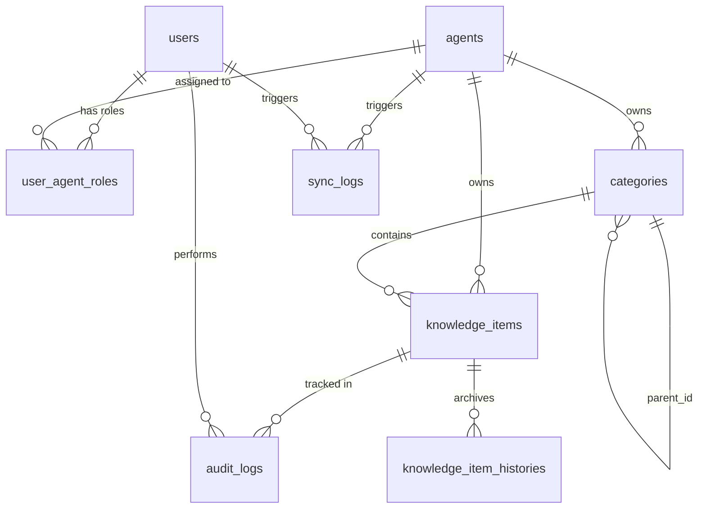
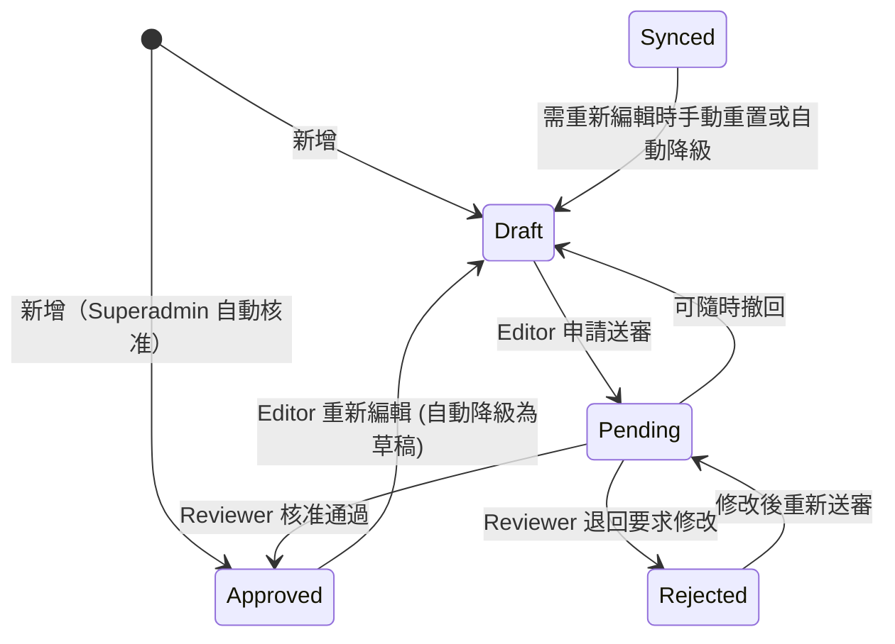

# Rasa RAG 系統知識庫管理平台：系統架構與詳細規格書

> **文件版本**：v1.1  
> **更新日期**：2026-04-27  
> **系統定位**：專門針對多代理 Rasa Enterprise Search (Extractive/FAQ 模式) 設計的知識庫 (Knowledge Base) 前後端分離管理與同步系統。

---

## 1. 系統架構 (System Architecture)

本系統採 **微服務與非同步解耦** 架構設計，確保前台操作不被阻塞，且 Ingestion Script（寫入向量庫）的負載可以被隔離。

### 1.1 容器與服務佈局 (Container Diagram)

```mermaid
graph TD
    subgraph Client
        UI[Frontend Web App\nReact+Vite / Tailwind / Zustand]
    end

    subgraph "Docker Compose (Management System)"
        API[Backend API\nFastAPI / Python 3.11]
        DB[(Primary DB\nPostgreSQL 15)]
        Redis[(Message Broker\nRedis 7)]
        Worker[Celery Worker\nAsync Task Engine\n(含 Python 執行環境)]
    end

    subgraph "External Services"
        RasaAPI[Rasa Server\nREST Endpoint]
        Qdrant[(Qdrant Vector DB)]
    end

    UI -- HTTP/REST --> API
    API -- Read/Write --> DB
    API -- Enqueue Task --> Redis
    Redis -- Consume Task --> Worker
    Worker -- Extract Approved Data --> DB
    Worker -- 1. Write .txt to shared volume --> Worker
    Worker -- 2. Execute Ingestion Script (容器內) --> Worker
    Worker -- 3. Script connects to Qdrant --> Qdrant
    API -- Forward Msg (Test Chat) --> RasaAPI

    note["註：使用者的 Ingestion Scripts\n透過 ./scripts/ volume\n掛載至 Worker 容器內的\n/opt/scripts/"]
    note -.-> Worker
```

### 1.2 系統邊界與職責
- **Backend API**: 負責身分驗證 (JWT)、RBAC 權限管理、商業邏輯、表單驗證、與資料庫互動。
- **Celery Worker**: 負責將資料庫中的龐大知識條目，轉換、編碼並匯出為實體 `.txt` 檔案，接著在**容器內**直接執行使用者的 Ingestion Script（容器內有完整 Python 執行環境），並將標準輸出 (stdout/stderr) 錄入資料庫。
- **Shared Volume 機制**：
  - 使用者的 ingestion scripts 透過 `./scripts/` host bind mount 掛載進入 Worker 容器內的 `/opt/scripts/`
  - 輸出的 `.txt` 存放於共享 volume，路徑由 `agents.txt_output_path` 決定（推薦格式：`/opt/rasa_docs/{agent_id}/`，使用 UUID 避免中文或特殊字元污染路徑）
  - 執行環境統一為容器內，**不再依賴宿主持有的 Python 環境或 shell**
  - 使用者的 Ingestion Script 需自行處理與 Qdrant 的連線（Qdrant 服務可能位于宿主機、其他主機或獨立容器，由 script 使用實際 IP/hostname 連線）

### 1.3 技術決策摘要 (Technical Decision Record)

以下為跨章節影響整體實作方向的架構決策，**實作前必讀**，避免選錯方向後大幅重寫。

| 決策點 | 選定方案 | 排除方案 | 理由 |
|--------|---------|---------|------|
| **SQLAlchemy 模式** | **同步**（`psycopg2-binary`、`Session`、`def` route） | 非同步（`asyncpg`、`AsyncSession`、`async def`） | Celery Worker 為同步環境，統一同步降低複雜度 |
| **Celery result backend** | **`task_ignore_result = True`**，不設任何 result backend | Redis / DB result backend | 任務狀態與 log 完整記錄於 `sync_logs` 表，不需 Celery 原生 result 查詢 |
| **Access token 黑名單** | **不查 Redis**，依賴 15 分鐘自然過期 | 每次請求查 Redis 黑名單 | Redis round-trip 對每個 API 請求代價過高；15 分鐘有效期可接受 |
| **Refresh token 黑名單** | **查 Redis**（僅限 `/auth/refresh` 與 `/auth/logout` 兩個端點） | — | Rotation 機制必要，確保舊 token 一次性使用 |

**同步 SQLAlchemy 實作要點**：

```python
# backend/api/database/session.py
from sqlalchemy import create_engine
from sqlalchemy.orm import sessionmaker, Session
from typing import Generator

engine = create_engine(DATABASE_URL, pool_pre_ping=True)
SessionLocal = sessionmaker(bind=engine)

def get_db() -> Generator[Session, None, None]:
    db = SessionLocal()
    try:
        yield db
    finally:
        db.close()
```

- Route 簽名一律使用 `def`（非 `async def`）；FastAPI 對同步 route 自動在 thread pool 執行，不阻塞 event loop
- `categories.updated_at` 與 `knowledge_items.updated_at` 需在 Column 設 `onupdate=func.now()`；Alembic autogenerate **不會**自動偵測此屬性，需手動在 migration 中補 `server_onupdate=FetchedValue()`

**Celery 設定要點**：

```python
# backend/tasks.py
from celery import Celery

celery_app = Celery('tasks', broker=REDIS_URL)
celery_app.conf.update(
    task_ignore_result=True,
    task_soft_time_limit=300,
    task_acks_late=True,
)
```

Docker Compose `celery_worker` 服務啟動命令：

```yaml
command: celery -A backend.tasks.celery_app worker --concurrency=2 --loglevel=info
```

---

## 2. 資料庫詳細設計 (Database Schema)

資料庫採用 PostgreSQL，利用強型別與 Foreign Key 確保多 Agent 環境下的資料隔離。以下為核心 ERD（實體關聯圖）與 Schema 定義。

### 2.1 實體關聯圖 (ERD)



### 2.2 核心資料表規格 (Table Specifications)

#### `users` (系統使用者)
全系統共用的帳號表。
| 欄位名稱 | 資料型別 | 屬性限制 | 說明 |
|---------|---------|---------|------|
| `id` | UUID | PK | 唯一識別碼 |
| `username` | VARCHAR(100) | UNIQUE, NOT NULL | 登入帳號 |
| `password_hash` | VARCHAR(255) | NOT NULL | Bcrypt 雜湊密碼 |
| `is_superadmin`| BOOLEAN | DEFAULT FALSE | 若為 True，則在無視映射表的情況下擁有全系統最高權限 |
| `is_active` | BOOLEAN | DEFAULT TRUE | 停用註記 |
| `created_at` | TIMESTAMP | NOT NULL, DEFAULT NOW() | 建立時間 |

#### `agents` (Rasa 代理專案)
紀錄系統中需要受控管理的各個 Rasa 服務個體。
| 欄位名稱 | 資料型別 | 屬性限制 | 說明 |
|---------|---------|---------|------|
| `id` | UUID | PK | 唯一識別碼 |
| `name` | VARCHAR(100) | UNIQUE, NOT NULL | Rasa 專案代稱 (e.g. `CustomerService_Bot`) |
| `txt_output_path` | VARCHAR(255) | NOT NULL | 主機上匯出 `.txt` 檔案的絕對路徑 |
| `rasa_rest_url` | VARCHAR(255) | NULLABLE | 供「對話測試」功能串接之 API Endpoint |
| `ingest_script_path` | VARCHAR(255) | NULLABLE | Ingestion script 的相對路徑（相對於 `./scripts/` 根目錄），例如 `customer_service/ingest.py` |
| `created_at` | TIMESTAMP | DEFAULT NOW() | |

#### `user_agent_roles` (代理權限映射)
多對多關聯表，記錄使用者在各 Agent 兼任的具體職責。
| 欄位名稱 | 資料型別 | 屬性限制 | 說明 |
|---------|---------|---------|------|
| `user_id` | UUID | PK, FK -> `users.id` | |
| `agent_id` | UUID | PK, FK -> `agents.id` | |
| `role` | ENUM | NOT NULL | `['reviewer', 'editor']` 角色劃分 |

#### `categories` (階層分類節點)
採用 Adjacency List 模型實現無限層級樹狀結構。
| 欄位名稱 | 資料型別 | 屬性限制 | 說明 |
|---------|---------|---------|------|
| `id` | UUID | PK | |
| `agent_id` | UUID | FK -> `agents.id` | 限定此分類所屬的專案 |
| `parent_id` | UUID | FK -> `categories.id`, NULLABLE | NULL 則代表根節點 (Root) |
| `name` | VARCHAR(120) | NOT NULL | 節點顯示名稱 |
| `sort_order` | INTEGER | DEFAULT 0 | 介面排序用權重 |
| `created_at` | TIMESTAMP | NOT NULL, DEFAULT NOW() | 建立時間 |
| `updated_at` | TIMESTAMP | NOT NULL, DEFAULT NOW() | 最新異動時間（ON UPDATE 觸發） |

#### `knowledge_items` (知識問答主檔)
存放最新當代版本的 FAQ 記錄。
| 欄位名稱 | 資料型別 | 屬性限制 | 說明 |
|---------|---------|---------|------|
| `id` | UUID | PK | |
| `agent_id` | UUID | FK -> `agents.id` | 確保資料隔離 |
| `category_id` | UUID | FK -> `categories.id` | 問題歸屬類別 |
| `question` | TEXT | NOT NULL | FAQ 之 問題內容 |
| `answer` | TEXT | NOT NULL | FAQ 之 回覆內容 |
| `tags` | VARCHAR[] | DEFAULT '{}' | 標籤陣列 |
| `status` | ENUM | NOT NULL | `['draft', 'pending', 'approved', 'rejected', 'synced']` |
| `version` | INTEGER | DEFAULT 1 | 記錄當下版號，每次更動累加 |
| `locked_by` | UUID | FK -> `users.id`, NULL | 當前編輯鎖持有者（防多人衝突）|
| `locked_at` | TIMESTAMP | NULL | 鎖定時間（逾時 10 分鐘自動解除）|
| `created_by` | UUID | FK -> `users.id` | 初始建立者 |
| `created_at` | TIMESTAMP | NOT NULL, DEFAULT NOW() | 建立時間 |
| `updated_at` | TIMESTAMP | NOT NULL, DEFAULT NOW() | 最新異動時間（ON UPDATE 觸發） |

#### `knowledge_item_histories` (知識問答版本庫)
不可變 (Immutable) 的紀錄表，記載所有變更與審查痕跡，用於 Rollback（回復）。
| 欄位名稱 | 資料型別 | 屬性限制 | 說明 |
|---------|---------|---------|------|
| `id` | UUID | PK | |
| `item_id` | UUID | FK -> `knowledge_items.id` | ON DELETE SET NULL（主條目刪除後，歷史軌跡保留供稽核使用） |
| `version` | INTEGER | NOT NULL | 版號 |
| `question` | TEXT | NOT NULL | 該版號當下留存之問題 |
| `answer` | TEXT | NOT NULL | 該版號當下留存之解答 |
| `category_id` | UUID | FK -> `categories.id` | 該版分類 |
| `saved_by` | UUID | FK -> `users.id` | 此版本締造者 |
| `action` | VARCHAR(50) | NOT NULL | `['created', 'edited', 'approved', 'rejected', 'rollback']` |
| `action_reason` | TEXT | NULLABLE | 填寫退回理由或審核評論；當 `action = 'rejected'` 時，後端應驗證此欄位不可為空（前端亦需提示必填） |
| `created_at` | TIMESTAMP | DEFAULT NOW() | |

#### `audit_logs` (軌跡紀錄表)
不可篡改的操作軌跡日誌，符合資安稽核要求。
| 欄位名稱 | 資料型別 | 屬性限制 | 說明 |
|---------|---------|---------|------|
| `id` | UUID | PK | |
| `agent_id` | UUID | FK -> `agents.id` | 所屬專案 |
| `item_id` | UUID | FK -> `knowledge_items.id` | 牽涉之 FAQ ID |
| `action` | VARCHAR(50) | NOT NULL | `['create', 'update', 'delete', 'approve', 'reject', 'export', 'import']` |
| `performed_by` | UUID | FK -> `users.id` | 執行操作之人員 |
| `diff` | JSONB | NULLABLE | 紀錄修改前後的欄位級別差異，格式為 `{"field": {"before": "舊值", "after": "新值"}}` 的物件，例如 `{"question": {"before": "舊問題", "after": "新問題"}, "status": {"before": "draft", "after": "pending"}}`；建立與刪除操作不記錄 diff |
| `created_at` | TIMESTAMP | DEFAULT NOW() | |

---

## 3. 業務邏輯規格與狀態機 (Business Logic & State Machine)

### 3.1 審核流程狀態機 (Status State Machine)


- **過濾原則**：「一鍵同步 (Ingestion)」執行時，後端會取出狀態為 `Approved OR Synced` 的所有 FAQ 並建置 `.txt` 文件。同步成功後，所有已同步項目標記為 `Synced`。
- **重新編輯**：`Synced` 或 `Approved` 的項目被編輯時，自動降級為 `Draft`。

### 3.2 角色權限矩陣 (RBAC Matrix)

| 行為 (Action) | Superadmin | Agent Reviewer | Agent Editor |
|--------------|------------|----------------|--------------|
| 管理人員/全系統 | ✅ | ❌ | ❌ |
| 新增/編輯 Agent | ✅ | ❌ | ❌ |
| 分類節點管理 | ✅ | ✅ | ❌ |
| 新增/修改 FAQ | ✅ | ✅ | ✅ |
| 刪除 FAQ | ✅ | ✅ (若非核准態) | ✅ (僅限自己建立且為草稿) |
| FAQ 送審 | ✅ (自動核准，跳過 pending 直接設為 approved) | ✅ | ✅ |
| 核准/退回 FAQ | ✅ | ✅ | ❌ |
| 版本查閱/復原 | ✅ | ✅ | ✅ |
| 觸發一鍵同步 | ✅ | ✅ | ❌ |
| Excel 匯入/匯出 | ✅ | ✅ | ✅ |
| 內建對話測試 | ✅ | ✅ | ✅ |

---

## 4. API 與同步通訊規格 (API Specifications)

由於系統採 SPA (React)，前後端以 RESTful API + JSON 介接，以下摘要關鍵 Endpoint：

### 4.0 系統端點

- `GET /api/v1/health`
  - **說明**: 健康檢查端點，供 Docker Compose `healthcheck` 及負載平衡器探測使用。**不需認證**。
  - **回應**: `{"status": "ok", "db": "ok", "redis": "ok"}` — 同時驗證 PostgreSQL 連線（執行 `SELECT 1`）與 Redis 連線（執行 `PING`），任一失敗則回傳 503。

### 4.1 Agent 專案配置路由 (Superadmin 限定)
- `POST /api/v1/agents`
  - **說明**: Superadmin 建立新 Agent。Request Body: `{ name, txt_output_path, rasa_rest_url, ingest_script_path }`。
- `GET /api/v1/agents`
  - 返回該使用者有權存取的所有 Agent 清單，供首頁「專案選擇」使用。
- `GET /api/v1/agents/{agent_id}`
  - **說明**: 查詢單一 Agent 詳細配置（含 `txt_output_path`、`rasa_rest_url`、`ingest_script_path`）。
- `PUT /api/v1/agents/{agent_id}`
  - **說明**: Superadmin 修改 Agent 基礎配置（Partial Update 也支援用 PATCH）。
- `DELETE /api/v1/agents/{agent_id}`
  - **說明**: Superadmin 刪除 Agent。若有關聯的 categories 或 knowledge_items，回 422 禁止刪除。
- `GET /api/v1/agents/{agent_id}/stats`
  - 返回 Agent 儀表板統計（待審核件數、各分類 FAQ 分佈、已同步件數）。
- `POST /api/v1/agents/{agent_id}/roles`
  - **說明**: Superadmin 為使用者分配 Agent 角色。Request Body: `{ user_id, role: 'reviewer' | 'editor' }`。
- `DELETE /api/v1/agents/{agent_id}/roles/{user_id}`
  - **說明**: Superadmin 移除使用者的 Agent 角色。

### 4.1.1 分類管理路由
- `GET /api/v1/agents/{agent_id}/categories`
  - **說明**: 返回該 Agent 的分類樹狀結構（CTE 遞迴查詢，返回嵌套 JSON）。
- `POST /api/v1/agents/{agent_id}/categories`
  - **說明**: 建立分類節點。Request Body: `{ name, parent_id (nullable), sort_order }`。需 Reviewer 或 Superadmin 權限。
- `PATCH /api/v1/agents/{agent_id}/categories/{category_id}`
  - **說明**: 修改分類節點（改名、移動父節點、調整排序）。需 Reviewer 或 Superadmin 權限。
- `DELETE /api/v1/agents/{agent_id}/categories/{category_id}`
  - **說明**: 刪除分類節點。若該節點或其子節點關聯 FAQ，回 422 禁止刪除；否則 CASCADE 刪除子節點。

### 4.2 FAQ 操作核心
所有請求必需將所選的 Agent Context 帶入 Path 或 Header（建議以 `X-Agent-Id: <uuid>` 或放置於 Path `/api/v1/agents/{agent_id}/...`）。
- `GET /api/v1/agents/{agent_id}/faqs?category_id=XXX&status=pending`
  - **說明**: 取得 FAQ 清單，支援分頁 (`page`, `per_page`)、排序 (`sort`, `order`)、過濾 (`category_id`, `status`, `tags`) 及文字搜尋 (`q`)。
- `GET /api/v1/agents/{agent_id}/faqs/{faq_id}`
  - **說明**: 查詢單一 FAQ 詳細內容。若被他人鎖定，回傳鎖定資訊；若鎖過期，自動清除並釋放。回傳的 `locked_by` 欄位需 JOIN `users` 表，同時回傳 `locked_by_id`（UUID）與 `locked_by_username`（VARCHAR），前端方可顯示「正在被 xxx 編輯中」。
- `POST /api/v1/agents/{agent_id}/faqs`
  - Request Body: `{ "category_id": "uuid", "question": "...", "answer": "..." }`
  - **Superadmin 自動核准**: 當 `current_user.is_superadmin == True` 時，系統自動將 `status = 'approved'`（跳過 pending 狀態），並同時寫入 `knowledge_item_histories` 與 `audit_logs` 記錄。
- `PATCH /api/v1/agents/{agent_id}/faqs/{faq_id}`
  - **說明**: 編輯 FAQ 內容（question, answer, category_id, tags）。需持有編輯鎖。若原狀態為 `approved` 或 `synced`，自動降級為 `draft`。每次編輯觸發 `knowledge_item_histories` 版本紀錄。
- `PATCH /api/v1/agents/{agent_id}/faqs/{faq_id}/status`
  - **說明**: 狀態轉換（送審 `draft→pending`、撤回 `pending→draft`、核准 `pending→approved`、退回 `pending→rejected`、重新送審 `rejected→pending`）。需對應角色權限。
  - Request Body: `{ "status": "approved", "reason": "" }`
- `POST /api/v1/agents/{agent_id}/faqs/{faq_id}/lock`
  - **說明**: 取得此 FAQ 編輯鎖，避免覆蓋衝突。設定 `locked_by = current_user_id`、`locked_at = now()`。
- `PUT /api/v1/agents/{agent_id}/faqs/{faq_id}/lock`
  - **說明**: 延長編輯鎖（心跳端點）。前端每 60 秒呼叫一次更新 `locked_at = now()`，確保持鎖期間不被 Lazy Expire 清除。需為當前鎖持有者才能延長。
- `DELETE /api/v1/agents/{agent_id}/faqs/{faq_id}`
  - **說明**: 刪除 FAQ。權限限制：Superadmin（全部）、Reviewer（非 approved/synced 態）、Editor（僅自己建立且為草稿）。
- `GET /api/v1/agents/{agent_id}/faqs/{faq_id}/histories`
  - **說明**: 查詢該 FAQ 的版本歷史紀錄（從 `knowledge_item_histories` 表）。
- `POST /api/v1/agents/{agent_id}/faqs/{faq_id}/rollback`
  - **說明**: 將 FAQ 內容復原至指定版本。Request Body: `{ "version": 3 }` → 覆蓋 question/answer 至該版本內容，自動降級為 `draft`，`version` 欄位累加。
- `DELETE /api/v1/agents/{agent_id}/faqs/{faq_id}/lock`
  - **說明**: 釋放編輯鎖。

### 4.3 匯入/匯出與對話測試
- `GET /api/v1/agents/{agent_id}/faqs/export`
  - **細節**: 匯出 Excel (`.xlsx`)。包含欄位：ID, 狀態, 分類路徑, 標籤, Question, Answer。
- `POST /api/v1/agents/{agent_id}/faqs/import`
  - **說明**: 解析上傳的 Excel 檔案，讀取對應欄位，將資料批次以 **`draft` 狀態**寫入（無論 Excel 中是否存在狀態欄位，匯入一律為草稿，需經正常審核流程），並回傳成功/失敗行數統計。
  - **必填欄位**：`question`、`answer`、`category_path`（以 `/` 分隔的路徑，如「常見問題/帳號管理」）
  - **選填欄位**：`tags`（逗號分隔字串）
  - **`category_path` 不存在時**：**自動建立**路徑中缺少的分類節點（若「常見問題」存在但「帳號管理」不存在，則新建「帳號管理」子節點）；若完整路徑均不存在，從根節點依序建立。此行為需在操作結果中標示「新建分類：xxx」。
  - **重複檢測**：相同 `agent_id` + `question` 組合已存在時，跳過並記錄至結果報告（不更新現有資料）。
  - **安全限制**: 檔案類型白名單（`.xlsx` 僅）、最大檔案大小 10MB、最大行數 5000 行、上傳後刪除暫存檔。
- `POST /api/v1/agents/{agent_id}/chat/test`
  - **細節說明**: 負責與 Rasa 的 REST 頻道對接。
  - **邏輯**: 
    1. 前端送出 `{ "message": "你好" }`。
    2. 後端查出該 Agent 設定的 `rasa_rest_url` (例如 `http://localhost:5005`)。
    3. 後端實際發送請求至 Rasa 官方要求之 REST webhook 接口：`POST {rasa_rest_url}/webhooks/rest/webhook`，並帶入 payload `{"sender": "{agent_id}_{user_id}", "message": "你好"}`（sender 組合 agent_id 與 user_id，避免不同 Agent 間的 Rasa conversation tracker 發生 ID 衝突）。
    4. 將 Rasa 的陣列回應（例如 `[{"recipient_id": "...", "text": "..."}]`）轉發給前端渲染。

### 4.4 Celery 非同步同步路由
- `POST /api/v1/agents/{agent_id}/sync`
  - **說明**: 要求觸發一鍵同步，Controller 驗證權限後發送排程 `tasks.run_ingestion_sync.delay(agent_id)`，並建立 `sync_logs` 記錄（`status = 'pending'`）
  - **回應**: `{"task_id": "<Celery task ID>", "sync_log_id": "<uuid>", "status": "pending"}`
  - **註**: Celery 預設採 UUID4 格式產生 task_id，例如 `a1b2c3d4-e5f6-7890-abcd-ef1234567890`
- `GET /api/v1/sync/tasks/{task_id}`
  - **說明**: 讓前端輪詢或透過 WebSocket 取得最新匯出與 Ingestion 執行 LOG。

---

## 5. 自動化匯出檔案規範 (Export File Specification)

當觸發一鍵同步任務時，Celery Worker 會依照以下確切規格於伺服器上組合知識檔案：

1. **編碼**：`UTF-8`
2. **路徑定義**：以資料庫中 `agents.txt_output_path` 為根目錄，例如 `/opt/rasa_project_A/docs/`
3. **檔案命名**：`faq_export.txt`（固定單一檔案，所有 approved/synced FAQ 匯出至同一檔案；不採多檔切分，以保持 Celery 任務的命令介面一致性）
4. **輸出排版防呆**：
   系統將完全剝離文字內的特殊保留字元，並依 Rasa 訓練所需的精確區塊劃分：
   ```text
   [Question]
   {{ faq.question }}
   
   [Answer]
   {{ faq.answer }}
   
   [Question]
   {{ faq.question }}
   ...
   ```
   *註：項目間嚴格控制為雙換行（\n\n）分隔，以確保不發生段落解析融合的問題。*

5. **關鍵字防護**：若 question 或 answer 內容中包含 `[Question]`、`[Answer]` 字串，在輸出前將其替換为全形方括號 `【Question】`、`【Answer】`，防止 Ingestion Script 誤解析內容中的保留字元為區塊標記。

---

## 6. 認證規格 (Authentication Specification)

### 6.1 JWT 架構

| 決策點 | 規格 |
|--------|------|
| JWT 儲存 | **HttpOnly Cookie**（Secure, SameSite=Strict）—— 防止 XSS 竊取 token |
| Access Token 有效期 | **15 分鐘** |
| Refresh Token 有效期 | **7 天** |
| JWT Payload | `{ sub: user_id, is_superadmin: bool, jti: uuid, iat, exp }` —— 角色**不**放 JWT（角色會隨時改），JWT 只驗證身分；`jti` 為每次簽發的唯一識別碼，供 revocation 使用 |
| Refresh Token Rotation | **每次 refresh 換發全新 access + refresh token**，舊 refresh token 的 `jti` 立即寫入 Redis 黑名單（TTL = 剩餘有效期），後續持舊 token 請求一律回 401 |
| 登出 revocation | `POST /auth/logout` 除清除 Cookie 外，同時將當前 refresh token 的 `jti` 加入 Redis 黑名單，確保伺服器端真正失效 |
| Redis 黑名單 key | `revoked_refresh:{jti}`，TTL = refresh token 剩餘有效期秒數 |
| 帳號建立 | **僅 Superadmin 可建立新帳號**，不開放自註冊 |
| 密碼重設 | **Superadmin 手動重設**，端點 `PATCH /api/v1/users/{id}/reset-password` |

### 6.2 認證路由

| 方法 | 端點 | 說明 |
|------|------|------|
| POST | `/api/v1/auth/login` | Request: `{ username, password }` → 回設 HttpOnly Cookie |
| POST | `/api/v1/auth/logout` | 清除 HttpOnly Cookie，並將 refresh token `jti` 加入 Redis 黑名單 |
| POST | `/api/v1/auth/refresh` | 舊 refresh token 換新 access + refresh token（Rotation）；舊 token `jti` 立即 revoke |
| GET | `/api/v1/auth/me` | 返回當前登入者基本資料（不含密碼雜湊） |
| POST | `/api/v1/users` | Superadmin 建立新帳號 `{ username, password, is_superadmin }` |
| GET | `/api/v1/users` | Superadmin 取得全部帳號清單（含 `is_active`、`is_superadmin`、建立時間） |
| PATCH | `/api/v1/users/{id}` | Superadmin 修改帳號（`is_active`、`is_superadmin`）|
| PATCH | `/api/v1/users/{id}/reset-password` | Superadmin 重置密碼 `{ new_password }` |

### 6.3 認證流程

1. **登入**：前端 POST `/auth/login` → 後端驗證帳密 → 設定兩支 HttpOnly Cookie（`access_token` / `refresh_token`，各含 `jti`）
2. **請求 API**：瀏覽器自動附帶 Cookie → FastAPI 解讀 access token → 驗證成功則繼續，過期則回 401
3. **Access Token 過期**：前端收 401 → 自動呼叫 `/auth/refresh`；後端驗證 refresh token 未被 revoke（查 Redis 黑名單）→ 換發新 access + refresh token（Rotation），舊 refresh `jti` 加入黑名單 → 前端重試原請求
4. **Refresh Token 也過期或被 revoke**：`/auth/refresh` 回 401，前端跳轉 `/login`，用戶需重新登入
5. **登出**：POST `/auth/logout` → 清除兩支 Cookie，**同時** revoke refresh token `jti`（寫入 Redis），確保 Cookie 泄漏後無法被濫用

---

## 7. API 規範 (API Conventions)

### 7.1 統一回應格式

**成功回應**：
```json
{
  "success": true,
  "data": { ... },
  "message": "操作成功"
}
```

**失敗回應**：
```json
{
  "success": false,
  "error": {
    "code": "FORBIDDEN",
    "message": "您無權核准此條目"
  }
}
```

### 7.2 HTTP Status Code 映射

| Status | 情境 |
|--------|------|
| 200 | 成功（GET、PATCH、PUT） |
| 201 | 建立成功（POST） |
| 400 | 參數驗證失敗 |
| 401 | 未認證 / Token 過期 |
| 403 | 無權限（有登入但角色不符） |
| 404 | 資源不存在 |
| 409 | 衝突（編輯鎖被他人持有） |
| 422 | 業務規則違反（如：草稿不可刪除、狀態轉換非法） |
| 500 | 伺服器內部錯誤 |

### 7.3 路由約定

- 所有路由統一前綴：`/api/v1/`
- Agent 上下文一律用 **Path 變數**：`/api/v1/agents/{agent_id}/...`
- 分頁參數：`?page=1&per_page=20&sort=updated_at&order=desc`
- 過濾參數：`?status=pending&category_id=uuid`（GET 查詢用）

---

## 8. 前端規格 (Frontend Specification)

### 8.1 技術棧定案

| 項目 | 技術 |
|------|------|
| UI 元件庫 | **shadcn/ui**（基於 Tailwind + Radix，零依賴安裝，可高度客製） |
| 狀態管理 | **Zustand**（輕量 hooks API，適合中型管理後台） |
| 前端路由 | **React Router v7** |
| API 客戶端 | **Axios** + 攔截器（自動附帶 Cookie、統一錯誤處理） |
| 資料表格 | **TanStack Table (React Table)** — headless，搭配 shadcn/ui 範例 |
| 表單處理 | **React Hook Form + Zod** — 前端驗證 schema |

### 8.2 前端路由結構

| URL | 頁面 | 說明 |
|-----|------|------|
| `/login` | 登入頁 | 帳密表單，登入成功重定向至 `/agents`（JWT 以 HttpOnly Cookie 儲存） |
| `/agents` | Agent 選擇器 | 登入後首頁，列出使用者有權存取的 Agent |
| `/agents/:id` | DashboardLayout | 核心佈局，含側邊欄導航 |
| `/agents/:id/dashboard` | 儀表板 | 統計：待審核件數、各分類分佈 |
| `/agents/:id/categories` | 分類管理 | 樹狀結構，增刪改分類節點 |
| `/agents/:id/faqs` | FAQ 清單 | 表格檢視，含過濾/搜尋/分頁 |
| `/agents/:id/faqs/:faq_id` | FAQ 詳細/編輯 | 編輯、版本歷史、Rollback |
| `/agents/:id/sync` | 同步管理 | 觸發同步、查看記錄 |
| `/agents/:id/chat` | 對話測試 | 即時聊天框，串接 Rasa REST |
| `/agents/:id/audit` | 軌跡追蹤 | 操作日誌查詢 |
| `/agents/:id/settings` | Agent 設定 | Superadmin 專用：修改 txt_output_path 等 |
| `/admin/users` | 使用者管理 | Superadmin 專用：帳號管理、角色分配 |

### 8.3 Sync 狀態回報

- **方式**：前端每 3 秒輪詢 `GET /api/v1/sync/tasks/{task_id}`
- **停止條件**：回傳 `status` 為 `completed` 或 `failed`
- **選擇理由**：簡單，不需額外 WebSocket 基礎設施；Sync 任務通常數秒至數分鐘內完成

### 8.4 Vite 開發環境 API Proxy 設定

`vite.config.ts` 的 proxy 目標須依執行環境區分：

| 執行方式 | proxy target |
|----------|-------------|
| 主機直接跑 `vite dev`（backend 以 `docker compose up` 或本機跑） | `http://localhost:8000` |
| `vite dev` 也在容器內跑（整組 compose） | `http://backend:8000`（Docker 內部 DNS） |

**預設採主機跑 `vite dev` 方案**（開發迭代速度最快）：
```typescript
// vite.config.ts
server: {
  proxy: {
    '/api': {
      target: 'http://localhost:8000',
      changeOrigin: true,
    },
  },
}
```

若切換至全容器化開發，再修改 target 為 `http://backend:8000`。

### 8.5 Axios 401 Refresh 競態處理

多個請求同時收到 401 時，若每個都各自觸發 `/auth/refresh`，第一次換發後舊 token 即被 revoke，後續請求會因持舊 refresh token 再次 refresh 而全部失敗。

**解法**：在 `src/api/client.ts` 的 response interceptor 實作 pending promise queue：

```typescript
let isRefreshing = false;
let refreshSubscribers: ((token: void) => void)[] = [];

// response interceptor
if (error.response?.status === 401 && !originalRequest._retry) {
  if (isRefreshing) {
    // 其他請求等候同一次 refresh 完成
    return new Promise(resolve => refreshSubscribers.push(resolve))
      .then(() => axiosInstance(originalRequest));
  }
  originalRequest._retry = true;
  isRefreshing = true;
  await axiosInstance.post('/api/v1/auth/refresh');
  refreshSubscribers.forEach(cb => cb());
  refreshSubscribers = [];
  isRefreshing = false;
  return axiosInstance(originalRequest);
}
```

確保整個 session 生命週期內，同時只發出一次 refresh 請求。

---

## 9. 環境變數 (Environment Variables)

### 9.1 `.env` 檔案規範

```env
# Database
DATABASE_URL=postgresql+psycopg2://rasa_admin:rasa_pass@db:5432/rasa_knowledge

# JWT
JWT_SECRET=CHANGE_ME_TO_RANDOM_STRING_64CHARS
JWT_ACCESS_MINUTES=15
JWT_REFRESH_DAYS=7

# Celery / Redis
REDIS_URL=redis://redis:6379/0

# CORS (開發環境)
CORS_ORIGIN=http://localhost:5173

# Backend
APP_HOST=0.0.0.0
APP_PORT=8000

# Ingestion Script (容器內使用)
QDRANT_HOST=localhost

# 日誌等級
LOG_LEVEL=INFO

# 初始 Superadmin（首次啟動時若 users 表為空，自動建立）
SEED_ADMIN_USERNAME=admin
SEED_ADMIN_PASSWORD=CHANGE_ME_8CHARS_UPPER_LOWER_NUM

# 生產環境
# CORS_ORIGIN=https://your-domain.com
# QDRANT_HOST=10.0.0.5
# LOG_LEVEL=INFO
```

所有程式碼透過 `os.getenv()` 讀取，**不可將 `.env` 存入 Git**。`.env.example`（不含實際密鑰）需加入版本控制。

---

## 10. Docker Compose 規格 (Docker Compose Specification)

### 10.1 服務配置

| 服務 | 映像 | Port (Host:Container) | 說明 |
|------|------|----------------------|------|
| `db` | postgres:15 | 5432:5432 | 主機資料庫 |
| `redis` | redis:7 | 6379:6379 | Celery Broker |
| `backend` | 自訂 Dockerfile | 8000:8000 | FastAPI 後端 |
| `celery_worker` | 共用 backend 映像 | — | Celery 背景工作 |
| `frontend` | 自訂 Dockerfile (Vite + Nginx) | 5173:5173 (dev) | React 前端 |

### 10.2 Volume 掛載

```yaml
volumes:
  pg_data:                    # PostgreSQL 持久化資料
  rasa_docs:                  # Celery Worker 輸出 .txt → host ingest script 讀取
    driver: local
    driver_opts:
      type: none
      o: bind
      device: ./data/volumes/rasa_docs  # 掛載到容器內的 /opt/rasa_docs
```

- `rasa_docs` volume 透過 bind mount 掛載到容器內的 `/opt/rasa_docs`
- Agent 的 `txt_output_path` 推薦設定為 `/opt/rasa_docs/{agent_id}/`（使用 UUID 作子目錄名，避免中文或特殊字元造成路徑問題，Superadmin 建立 Agent 時應遵循此慣例）
- 主機上的 Ingestion Script 直接讀取 `./data/volumes/rasa_docs/{agent_id}/` 下的檔案

### 10.3 Network

- 使用 Docker Compose 預設 bridge network（自動建立），5 個服務在同一 compose 中互通
- 不需額外 network 配置

### 10.4 健康檢查

```yaml
services:
  db:
    healthcheck:
      test: ["CMD-SHELL", "pg_isready -U rasa_admin -d rasa_knowledge"]
      interval: 10s
      timeout: 5s
      retries: 5

  redis:
    healthcheck:
      test: ["CMD", "redis-cli", "ping"]
      interval: 10s
      timeout: 5s
      retries: 5

  backend:
    healthcheck:
      test: ["CMD-SHELL", "curl -f http://localhost:8000/api/v1/health || exit 1"]
      interval: 15s
      timeout: 5s
      retries: 3
      start_period: 30s
    depends_on:
      db: { condition: service_healthy }
      redis: { condition: service_healthy }

  celery_worker:
    depends_on:
      db: { condition: service_healthy }
      redis: { condition: service_healthy }
      backend: { condition: service_healthy }
```

### 10.5 .env 注入

- Docker Compose 讀取根目錄 `.env` 的用途是**compose 檔本身的變數插值**（例如 `image: myapp:${TAG}`），**不會**自動將 `.env` 中的鍵值傳入容器環境
- 各服務需顯式加入 `env_file: .env`，容器內的 Python / Node 程序才能透過 `os.getenv()` 或 `process.env` 讀取到對應值
- 範例（須加入每個需要環境變數的服務）：
  ```yaml
  services:
    backend:
      env_file: .env
    celery_worker:
      env_file: .env
  ```
- `frontend` 服務（Nginx 靜態伺服）通常無需注入，但 build 階段若需環境變數，應透過 `build.args` 傳遞（Vite 以 `VITE_` 前綴的 build arg 取代 runtime env）

---

## 11. 資料庫索引 (Database Indexes)

以下索引需在初始 migration 中建立，確保高頻查詢效能：

```sql
-- knowledge_items：多 Agent 過濾 + 狀態過濾 + 分類查詢
CREATE INDEX idx_ki_agent_id ON knowledge_items(agent_id);
CREATE INDEX idx_ki_status ON knowledge_items(status);
CREATE INDEX idx_ki_category_id ON knowledge_items(category_id);

-- 編輯鎖查詢（部分索引，只索引有鎖的記錄）
CREATE INDEX idx_ki_locked_by ON knowledge_items(locked_by) WHERE locked_by IS NOT NULL;

-- categories：按 Agent 過濾 + 樹狀遞迴查詢
CREATE INDEX idx_cat_agent_id ON categories(agent_id);
CREATE INDEX idx_cat_parent_id ON categories(parent_id);

-- audit_logs：按 Agent / FAQ 查詢軌跡
CREATE INDEX idx_al_agent_id ON audit_logs(agent_id);
CREATE INDEX idx_al_item_id ON audit_logs(item_id);
CREATE INDEX idx_al_created_at ON audit_logs(created_at DESC);

-- sync_logs：按 Agent 查詢同步記錄
CREATE INDEX idx_sl_agent_id ON sync_logs(agent_id);
CREATE INDEX idx_sl_started_at ON sync_logs(started_at DESC);

-- user_agent_roles：權限檢查頻繁查詢
CREATE INDEX idx_uar_user_id ON user_agent_roles(user_id);
CREATE INDEX idx_uar_agent_id ON user_agent_roles(agent_id);
```

---

## 12. Celery 任務規格 (Celery Task Specification)

### 12.1 核心任務

| 任務 | 簽名 | 說明 |
|------|------|------|
| `run_ingestion_sync` | `run_ingestion_sync(agent_id: str)` | 主同步任務：提取 approved/synced FAQ → 寫 .txt → 執行 ingest script → 標記 synced |

### 12.2 任務參數

| 參數 | 值 | 說明 |
|------|-----|------|
| 重試次數 | 3 次 | 指數退避：10s → 20s → 40s |
| 任務超時 | 300 秒 (5 分鐘) | `soft_time_limit=300` |
| Worker 並發數 | `--concurrency=2` | 避免多個 sync 同時寫入同一主機路徑 |
| 結果儲存 | **DB（sync_logs 表）** | 不使用 Redis result backend，所有結果持久化至 PostgreSQL |
| 錯誤處理 | 任務失敗時更新 `sync_logs.status = 'failed'` 並存留 `stderr` | 前端輪詢可獲取失敗訊息 |

### 12.3 任務執行流程

1. 接收 `agent_id` → 查詢 `agents` 取得 `txt_output_path`、`ingest_script_path`
2. 查詢 `knowledge_items` 中 `agent_id` 且 `status IN ('approved', 'synced')` 的所有記錄
3. 依 §5 規格生成 `.txt` 內容 → 寫入 `txt_output_path/faq_export.txt`
4. 使用 `subprocess.run()` 執行 ingest script：
   - 從 `agents.ingest_script_path` 取得相對路徑（如 `customer_service/ingest.py`）
   - 在容器內執行 `python /opt/scripts/{ingest_script_path} {txt_output_path}/faq_export.txt`（`txt_output_path` 直接使用 `agents` 表中的欄位值，Celery Worker 不自行拼接路徑）
   - 捕獲 `stdout` / `stderr` / `returncode`
5. 同步成功後，將所有已同步項目標記為 `status = 'synced'`
6. 將結果寫入 `sync_logs` 表
7. 返回 `sync_log_id` 供前端輪詢

---

## 13. sync_logs 資料表 (Sync Logs Table)

Implementation Plan §2 提及的同步紀錄表：

| 欄位名稱 | 資料型別 | 屬性限制 | 說明 |
|---------|---------|---------|------|
| `id` | UUID | PK | 唯一識別碼 |
| `agent_id` | UUID | FK → `agents.id` | 所屬專案 |
| `triggered_by` | UUID | FK → `users.id` | 觸發者 |
| `celery_task_id` | VARCHAR(255) | NULL | Celery task ID |
| `status` | ENUM | NOT NULL | `['pending', 'running', 'completed', 'failed']` |
| `items_count` | INTEGER | DEFAULT 0 | 實際匯出的條目數 |
| `output_file` | VARCHAR(500) | NULL | 寫入的完整檔案路徑 |
| `stdout` | TEXT | NULL | Ingestion script 標準輸出 |
| `stderr` | TEXT | NULL | Ingestion script 標準錯誤 |
| `started_at` | TIMESTAMP | NULL | 任務開始時間 |
| `finished_at` | TIMESTAMP | NULL | 任務完成時間 |
| `duration_sec` | INTEGER | NULL | 執行耗時（秒） |
| `created_at` | TIMESTAMP | DEFAULT NOW() | 記錄建立時間 |

---

## 14. 編輯鎖逾時機制 (Lock Expiry Mechanism)

### 14.1 Lazy Expire（惰性過期）

- **不**使用 Celery Beat 或背景排程定期清理
- 在每次 `GET /faq/:id` 或 `PATCH /faq/:id` 時執行檢查：
  - 若 `locked_by IS NOT NULL` 且 `locked_at < NOW() - INTERVAL '10 minutes'` → 自動清除鎖定（設 `locked_by = NULL, locked_at = NULL`）
  - 清除動作在同一 DB transaction 中完成，不產生死鎖

### 14.2 前端 UX

- 前端在 `GET /faq/:id` 回傳中若發現 `locked_by` 變為 `null`，解除編輯鎖定狀態
- 前端每 60 秒自動 `PATCH` 延長當前使用者的鎖定（若仍在編輯畫面）
- 使用者導離編輯頁面時，前端自動呼叫 `DELETE /lock` 釋放

---

## 15. 安全性考量 (Security Considerations)

### 15.1 Command Injection 防護

- `ingest_script_path` 僅 **Superadmin** 可設定和修改
- Celery Worker 執行時使用 `shlex.split()` 拆解指令字串
- 不直接使用 `shell=True` 呼叫 subprocess

### 15.2 XSS 防護

- FAQ 內容在前端渲染前經 `DOMPurify` sanitize
- **不**使用 `dangerouslySetInnerHTML` 直接渲染原始內容

### 15.3 SQL Injection 防護

- 全數使用 SQLAlchemy ORM 參數化查詢，不需額外防護

### 15.4 CORS 策略

**後端配置**：

- 開發環境：`CORS_ORIGIN=http://localhost:5173`（FastAPI CORSMiddleware 的 `allow_origins`）
- 生產環境：設定為實際前端域名（Nginx 同源，CORS 通常不觸發，但仍應設定保護）
- `allow_credentials=True`（允許跨 origin 請求帶 Cookie）
- `allow_origins` **不可設 `["*"]`**，必須明確列出 origin；`allow_credentials=True` 與 `*` 不相容，FastAPI 會報錯

**前端配置**：

- Axios 全域設定 `withCredentials: true`，所有請求才會自動附帶 Cookie
- 不設此旗標時，跨 port 的請求不帶 Cookie，即使後端 CORS 設定正確也無效

**SameSite=Strict 與 CSRF 防護說明**：

- 本系統開發環境（`http://localhost:5173` → `http://localhost:8000`）屬 same-site（`localhost` 無 eTLD+1，同視為 same-site），`SameSite=Strict` 不阻擋開發環境的跨 port 請求
- 生產環境採 Nginx 反向代理，前後端同 origin，`SameSite=Strict` 完全有效
- `SameSite=Strict` 本身即為 CSRF 防護：跨站（cross-site）發起的請求不帶 Cookie，攻擊者無法偽造有效 session，**無需額外實作 CSRF token 機制**

### 15.5 子程序執行限制

- Celery Worker 僅能執行 `agents` 表中設定的 `ingest_script_path` 指向的 script
- 不開放前端直接指定執行指令
- 子程序超時強制終止（`subprocess.TimeoutExpired`）

### 15.6 Ingestion Script 容器化執行細節

- **存放位置**：使用者將 ingestion scripts 放置在 `./scripts/` 根目錄下
- **Volume 掛載**：`docker-compose.yml` 透過 volume 將宿主機的 `./scripts` 掛載到 Worker 容器內的 `/opt/scripts`（唯讀 `:ro`）
- **執行方式**：Worker 執行時呼叫：
  ```python
  script_path = "/opt/scripts/{agents.ingest_script_path}"  # 如 /opt/scripts/customer_service/ingest.py
  subprocess.run(["python", script_path, f"{agent.txt_output_path}/faq_export.txt"])
  ```
- **ingest_script_path 欄位**：儲存相對於 `./scripts/` 根目錄的 script 路徑，例如 `customer_service/ingest.py`
- **Qdrant 連線**：使用者的 script 需自行處理與 Qdrant 的連線。Qdrant 服務可能位于宿主機、其他主機或獨立容器，由 script 使用環境變數 `QDRANT_HOST` 連線

---

## 16. 測試策略 (Testing Strategy)

### 16.1 測試框架

| 層級 | 框架 | 說明 |
|------|------|------|
| 後端單元測試 | **pytest + pytest-asyncio** | 測試模型、工具函數、服務層邏輯 |
| 前端單元測試 | **Vitest + React Testing Library** | 測試 React 元件、hooks、状態管理 |
| 整合測試 | **pytest + TestClient** | 測試 API endpoint + DB 互動 |
| E2E 測試 | **Playwright** | 測試完整使用者流程（登入、CRUD、同步） |

### 16.2 Mock 策略

- **Celery 任務**：使用 `celery.contrib.test_utils` 將 async task 轉為同步執行，避免測試時需要 Redis 連線
- **外部 API（Rasa REST）**：使用 `responses` library mock HTTP 回應，隔離外部依賴
- **Qdrant 連線**：由 ingestion script 自行處理，測試時不模擬 Qdrant 實際連線（屬於合同測試範圍）

### 16.3 CI/CD 測試執行流程

1. **Lint 檢查**：`ruff check`（後端）、`eslint`（前端）
2. **類型檢查**：`mypy`（後端）、`tsc --noEmit`（前端）
3. **單元測試**：`pytest`（後端）、`vitest run`（前端）
4. **整合測試**：`pytest --integration`（啟動 Docker Compose 服務後執行）
5. **E2E 測試**：Playwright 測試（全量部署後執行）
6. **覆蓋率報告**：後端 `pytest-cov` > 80% 覆蓋率門檻

### 16.4 測試資料管理

- 使用 `@pytest.fixture` 建立測試資料庫 session（每次測試前 truncate，測試後 rollback）
- Factory 模式：使用 `factory_boy` 生成測試資料，避免硬編碼 fixture

### 16.5 後端日誌標準

採用 Python 標準 `logging` 模組，透過 `structlog` 輸出結構化 JSON 日誌，確保 ELK / Grafana Loki 等工具可解析。

| 設定項目 | 值 |
|---------|-----|
| 日誌格式 | JSON（含 `timestamp`、`level`、`event`、`request_id`、`user_id`） |
| 日誌等級 | 生產環境 `INFO`；開發環境 `DEBUG`（透過 `.env` 的 `LOG_LEVEL` 切換） |
| Request ID | FastAPI middleware 為每個請求生成 UUID，寫入 `contextvars`，所有下游日誌自動帶入 `request_id` |
| Celery 任務日誌 | Celery 任務啟動 / 完成 / 失敗均寫入結構化日誌，task_id 帶入 `celery_task_id` 欄位 |
| 敏感資料 | `password`、`password_hash`、`JWT_SECRET` 等欄位**不可**寫入日誌 |

加入 `requirements.txt`：`structlog>=24.0`。

---

## 17. 資料庫 Migration 策略 (Database Migration Strategy)

### 17.1 工具

- **Alembic**（已包含在 requirements.txt），與 SQLAlchemy ORM 緊密整合

### 17.2 初始建置

```bash
alembic upgrade head
```
在 Docker Compose 啟動後自動執行，確保所有表結構建立完成。

### 17.3 版本管理

每次 schema 變更產生新 migration：
```bash
alembic revision --autogenerate -m "description_of_change"
```
產生後**需手動審查** migration 檔內容，確保 autogenerate 正確捕捉所有變更。

### 17.4 Rollback

```bash
alembic downgrade -1    # 回退一個版本
alembic downgrade <revision>  # 回退到指定版本
```

### 17.5 CI/CD 自動化

- 服務啟動前自動檢測 migration 狀態
- 若 migration 待執行，自動執行 `alembic upgrade head`
- Migration 失敗時阻止服務啟動，並回傳明確錯誤訊息至日誌

### 17.6 Migration 最佳實踐

- 每個 migration 檔對應單一邏輯變更（一次 migration = 一個功能）
- 避免在同一 migration 中混合 DDL 和 DML 操作
- 生產環境執行 migration 前，先在 Staging 環境驗證

---

## 18. 密碼策略與安全參數 (Password Policy & Security Parameters)

### 18.1 密碼規則

| 參數 | 值 | 說明 |
|------|-----|------|
| 最小長度 | **8 字元** | 不含 8 字元不通過 |
| 複雜度要求 | **至少包含大寫、小寫、數字** | 英文大寫 (A-Z) + 英文小寫 (a-z) + 數字 (0-9) 各至少一個 |
| 驗證層級 | **前端 zod + 後端二次驗證** | 前端即時反饋，後端作為最後防線 |

### 18.2 雜湊參數

| 參數 | 值 | 說明 |
|------|-----|------|
| Bcrypt cost factor | **12** | 平衡安全性與效能（雜湊時間約 250ms） |
| 雜湊演算法 | **bcrypt** | 使用 `passlib[bcrypt]` 進行密碼雜湊 |

### 18.3 JWT 安全

| 參數 | 值 | 說明 |
|------|-----|------|
| JWT Secret 最小長度 | **64 字元** | 使用 `secrets.token_urlsafe(64)` 產生 |
| 簽名演算法 | **HS256** | HMAC with SHA-256 |

### 18.4 登入防爆破

| 參數 | 值 | 說明 |
|------|-----|------|
| 失敗鎖定門檻 | **5 次** | 同一 IP + 帳號組合累積失敗 5 次 |
| 鎖定時間 | **15 分鐘** | 鎖定期間一律回傳 429 Too Many Requests |
| 儲存機制 | **Redis 計數器** | Key 格式：`login_attempts:{ip}:{username}`，TTL 15 分鐘 |

---

## 19. 錯誤處理與回退方案 (Error Handling & Fallback)

### 19.1 同步失敗三级處置

| 級別 | 措施 | 說明 |
|------|------|------|
| **一級** | 自動重試 | Celery 任務內建 3 次指數退避重試（10s → 20s → 40s） |
| **二級** | 手動重試 | 前端 Sync 頁面提供「重新同步」按鈕，Reviewer 可手動觸發重試 |
| **三級** | 通知機制 | 失敗時寫入 `sync_logs.status = 'failed'` 並在前端顯示紅色警告，附帶 stderr 內容 |

### 19.2 `.txt` 備份機制

- 每次覆蓋 `faq_export.txt` 前，將前一版本備份為 `faq_export.txt.backup`
- 若當前同步失敗，可透過手動將 `.backup` 復原到 `.txt` 進行回退
- 僅保留一個備份檔（最新覆蓋前的版本），避免磁碟空間浪費
- **從 sync_logs 重建**：若 `.backup` 也損毀，可查詢 `sync_logs` 找到最近成功的 `sync_log_id`，再以相同 `agent_id` 重新觸發一次同步任務，從 PostgreSQL 當前的 `approved/synced` 資料重新生成 `.txt`（資料源頭在 DB，`.txt` 是派生物，可隨時重建）

### 19.3 部分失敗處理

- 單一 FAQ 解析失敗**不中斷**整體同步流程
- 失敗的 FAQ 項目標記至 stderr 輸出，格式：`[SKIP] FAQ #{id}: {error_message}`
- 同步結果回報：`{"total": 100, "synced": 98, "skipped": 2, "errors": [...]}`
- 跳過的 FAQ 在前端 Sync 頁面以黃色警告標示，供人工檢查

### 19.4 Worker 異常處理

- Worker 執行時若發生未預期例外，Celery 自動將任務標記為 `FAILED`
- `sync_logs` 表記錄完整 traceback（截斷至 1000 字元）
- 前端輪詢時若發現 `status = 'failed'`，顯示錯誤詳情並提供重試入口

---

## 20. v0.2 文件廢止宣告 (Deprecation Notice)

> `[design-knowledge-base-management.md](design-knowledge-base-management.md)` (v0.2) 已被本文 (v1.0) **完全取代**。
> 兩版本之間的差異：
> - v0.2 的 `knowledge_items` 缺少 `tags`、`locked_by`、`locked_at` 欄位
> - v0.2 的 `knowledge_items_history`（單數）已改為 `knowledge_item_histories`（複數）
> - v0.2 的 `status` 枚舉為 `draft / pending / approved / synced / rejected`，v1.0 維持 `synced` 但補充了完整的狀態轉移規則和 Superadmin 跳躍路徑
> - v0.2 的 `knowledge_item_histories` 使用 `reason` 欄位，v1.0 分為 `action` + `action_reason`
> - v0.2 的 `agents` 使用 `ingest_command`（完整 CLI 指令），v1.0 改為 `ingest_script_path`（相對於 `./scripts/` 的相對路徑）
> - 實作時以 **本文 (v1.1) 為準**。

---

## 21. v1.1 修訂記錄 (Revision History)

> **修訂日期**：2026-04-27  
> **修訂原因**：可實作性審查發現兩項阻斷性技術錯誤（A3、A4），及兩項規格說明不完整（A1、A2），本次修訂予以修正或補充說明。

### 21.1 [A3 修正] Vite 開發環境 Proxy 目標（原為阻斷問題）

- **問題**：實施計畫 §第一階段將 `vite.config.ts` proxy target 設為 `http://backend:8000`，此為 Docker 容器內部 DNS，本機跑 `vite dev` 時無法解析，proxy 連線失敗。
- **修正**：新增 §8.4（Vite 開發環境 API Proxy 設定），明確規定主機開發時目標為 `http://localhost:8000`，並說明全容器化開發的切換方式。

### 21.2 [A4 修正] Docker Compose .env 注入機制（原為阻斷問題）

- **問題**：§10.5 宣稱「根目錄 `.env` 由 Compose 自動注入到所有服務」，此說法**錯誤**。Compose 的 `.env` 僅供 compose 檔本身變數插值，不傳入容器環境，會導致後端無法讀取 `DATABASE_URL`、`JWT_SECRET` 等關鍵環境變數。
- **修正**：§10.5 重寫，明確要求各服務加入 `env_file: .env`，並說明 Vite build 環境變數的正確傳遞方式。

### 21.3 [A1 澄清] Cookie SameSite=Strict 與跨域行為（原評估為阻斷，重新評估後非阻斷）

- **原疑慮**：`SameSite=Strict` 配合跨 port 請求（5173 → 8000）會阻擋 Cookie。
- **澄清**：`SameSite` 的「site」定義基於 eTLD+1，`localhost` 無 eTLD+1，`localhost:5173` 與 `localhost:8000` 屬 same-site，`Strict` 不阻擋此請求。生產環境採 Nginx 同源亦無問題。
- **補充**：§15.4 新增後端 `allow_credentials=True` + 具體 origin 配置要求，及前端 Axios `withCredentials: true` 全域設定要求，確保跨 port 的 Cookie 傳輸正確運作。

### 21.4 [A2 澄清] CSRF 防護（原評估為阻斷，重新評估後已覆蓋）

- **原疑慮**：規格未定義 CSRF token 機制。
- **澄清**：`SameSite=Strict` 本身即為 CSRF 防護，跨站（cross-site）請求不攜帶 Cookie，攻擊者無法偽造有效 session。本系統純 JSON API、無 form action，進一步降低 CSRF 攻擊向量。
- **補充**：§15.4 新增 SameSite=Strict 防護說明，不需額外 CSRF token 實作。

---

### 21.5 [B1 修正] `{agent_name}` 路徑安全性

- **問題**：§1.2、§10.2、§12.3、§15.6 使用 `{agent_name}` 動態拼接檔案系統路徑，`agents.name` 允許中文與特殊字元，導致路徑注入或編碼問題風險。
- **修正**：所有路徑範例改為 `{agent_id}`（UUID），Superadmin 建立 Agent 時推薦以 UUID 為子目錄名；§12.3 Celery Worker 改為直接使用 `agents.txt_output_path` 欄位值，不自行拼接路徑。

### 21.6 [B2 修正] Refresh Token Rotation 與 Revocation

- **問題**：原規格僅清除 Cookie，Refresh Token 在伺服器端仍有效，被竊後可長期濫用。
- **修正**：§6.1 新增 JWT `jti` 欄位與 Redis 黑名單機制；§6.2 logout 端點補充 revoke 行為；§6.3 認證流程補充 rotation + revocation 完整說明。

### 21.7 [B3 修正] 編輯鎖延長 API 缺失

- **問題**：§14.2 要求前端每 60 秒延長鎖定，但 §4.2 路由清單未提供對應端點。
- **修正**：§4.2 新增 `PUT /faqs/{faq_id}/lock` 心跳端點，需為當前鎖持有者才能延長。

### 21.8 [B4 修正] 多檔切分策略矛盾

- **問題**：§5 提「可切分成多個 faq_category1.txt」，但 §12.3 固定單檔且 ingest script 命令只傳一個檔案路徑，兩者矛盾。
- **修正**：§5 確立**固定單檔**策略，刪除多檔切分描述。

### 21.9 [B5 修正] Axios Token Refresh 競態

- **問題**：多個請求同時收到 401 各自觸發 refresh，第一次 rotation 後舊 token 被 revoke，其餘請求 refresh 失敗導致使用者被登出。
- **修正**：§8.5 新增 pending promise queue 實作模式，確保同時只發出一次 refresh 請求。

### 21.10 [C1 修正] sync_logs 狀態值不一致

- **問題**：§4.4 同步端點回應範例為 `"status": "processing"`，與 §13 定義的 ENUM `['pending','running','completed','failed']` 不符。
- **修正**：§4.4 回應範例改為 `"status": "pending"`，並補充 `sync_log_id` 欄位。

### 21.11 [C2 修正] Celery task_id 說明自相矛盾

- **問題**：§4.4 說「非標準 UUID 格式」但範例給的是標準 UUID4。
- **修正**：§4.4 說明改為「Celery 預設採 UUID4 格式」，與範例一致。

### 21.12 [C5/C6 修正] categories 與 knowledge_items 缺時間戳

- **問題**：`categories` 無任何時間戳，`knowledge_items` 缺 `created_at`，無法稽核建立時間。
- **修正**：§2.2 `categories` 新增 `created_at` / `updated_at`；`knowledge_items` 新增 `created_at`。

### 21.13 [D1 補充] audit_logs.diff JSONB 結構

- **補充**：§2.2 `audit_logs.diff` 欄位說明明確規範 JSON 格式：`{"field": {"before": "舊值", "after": "新值"}}`。

### 21.14 [D2/D3 補充] Excel 匯入細節

- **補充**：§4.3 import 端點說明新增：匯入一律 `draft` 狀態；`category_path` 不存在時自動建立分類節點；重複 question 跳過並記錄。

### 21.15 [D4 補充] action_reason 必填條件

- **補充**：§2.2 `knowledge_item_histories.action_reason` 說明補充：`action = 'rejected'` 時後端驗證不可為空。

### 21.16 [D5 補充] GET /health 端點與 backend healthcheck

- **補充**：§4.0 新增系統健康檢查端點；§10.4 backend 服務新增 healthcheck 設定，celery_worker 新增依賴 backend 健康。

### 21.17 [D6 補充] GET /api/v1/users 端點

- **補充**：§6.2 新增 `GET /api/v1/users`（Superadmin 限定），Superadmin 管理頁面必要。

### 21.18 [D7 補充] 後端日誌標準

- **補充**：§16.5 新增結構化日誌規範（structlog + JSON 格式、request_id 傳遞、敏感資料遮蔽）。

### 21.19 [D8 補充] locked_by_username 回傳

- **補充**：§4.2 GET /faq/:id 說明補充：需 JOIN users 表回傳 `locked_by_username`，前端方可顯示持鎖者姓名。

### 21.20 [D9 補充] chat/test sender 格式

- **補充**：§4.3 sender 由 `{user_id}` 改為 `{agent_id}_{user_id}`，避免跨 Agent 的 Rasa tracker ID 衝突。

### 21.21 [D11 補充] .txt 備份回復策略

- **補充**：§19.2 新增「從 PostgreSQL 重建」說明，`.txt` 是派生物，資料源頭在 DB，可隨時透過重新觸發同步重建。
